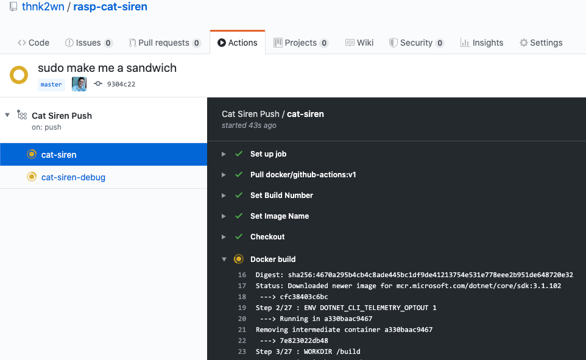
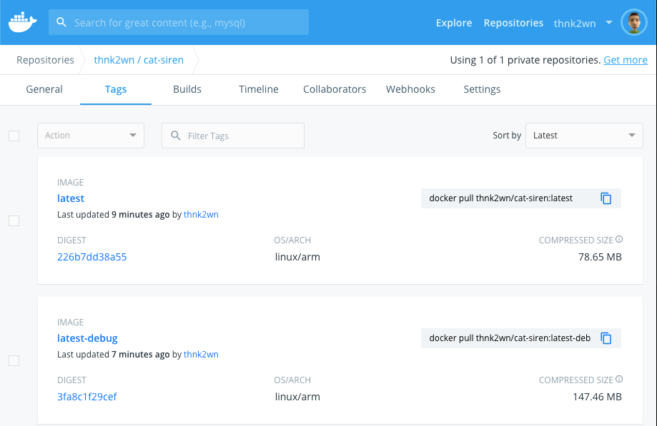
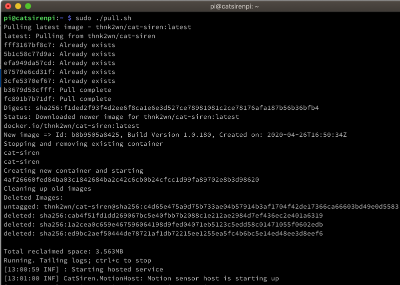
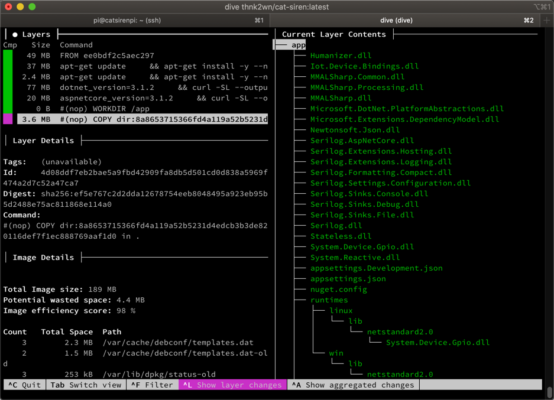

\[toc wrapping="right"\]

The [last post](https://wp.me/p8RapM-Kw) in [this series](https://wp.me/p8RapM-Is) explored different ways of deploying .Net apps to a Raspberry Pi and touched on some of the pros and cons of using Docker for this. This post covers using [GitHub actions](https://github.com/features/actions) to build a Raspberry Pi image and deploy to [Docker Hub](https://hub.docker.com/) when commits are pushed to the repository.

## Getting Started

An easy way of starting an action is navigating to the Actions tab of a GitHub repo and choosing a workflow - it'll even recommend ones based on existing repo contents. After that it'll open the action yaml in an online editor add help setup a commit. Personally I chose to copy the yaml to VS Code and commit myself. I also recommend this [YAML extension](https://marketplace.visualstudio.com/items?itemName=redhat.vscode-yaml) with the whitespace-sensitive pain that the language brings. The actions are stored in the repo under `/.github/workflows`. To get an idea of the extensive capabilities of GitHub actions, try [awesome-actions](https://github.com/sdras/awesome-actions). If new to actions, taking a [free GitHub learning lab course](https://lab.github.com/githubtraining/github-actions:-hello-world) may be helpful.

## Building and Revising Action Workflow

### Initial, Direct GitHub Action

Before the [first official Docker GitHub action was announced](https://www.docker.com/blog/first-docker-github-action-is-here/) I had started with this [opspresso/action-docker](https://github.com/marketplace/actions/docker-push) action. Later my security paranoia kicked in about integrating with unknown 3rd party actions so I switched to doing the steps more manually / directly in the action, like below.

\[yaml\] name: Cat Siren Push

on: push: paths: - 'siren/\*\*' - '.github/workflows/push-siren.yml'

jobs: cat-siren: runs-on: ubuntu-latest

steps: - name: Set Build Date run: echo "::set-env name=BUILD\_DATE::$(date +'%Y-%m-%d %H:%M:%S')"

\- name: Set Build Number run: echo "::set-env name=BUILD\_VER::1.0.$GITHUB\_RUN\_NUMBER"

\- name: Set Image Name run: echo "::set-env name=IMG::cat-siren"

\- name: Checkout uses: actions/checkout@v1

\- name: Docker login run: echo "${{ secrets.DOCKER\_PASSWORD }}" | docker login -u ${{ secrets.DOCKER\_USERNAME }} --password-stdin

\- name: Docker build working-directory: ./siren run: | docker build \\ --build-arg GIT\_SHA=${{ github.sha }} \\ --build-arg GIT\_REF=${{ github.ref }} \\ --build-arg BUILD\_DATE="${{ env.BUILD\_DATE }}" \\ --build-arg BUILD\_VER=${{ env.BUILD\_VER }} \\ -t ${{ env.IMG }} .

\- name: Docker tags run: | docker tag ${{ env.IMG }} ${{ secrets.DOCKER\_USERNAME }}/${{ env.IMG }}:${{ env.BUILD\_VER }} docker tag ${{ env.IMG }} ${{ secrets.DOCKER\_USERNAME }}/${{ env.IMG }}:${{ github.sha }} docker tag ${{ env.IMG }} ${{ secrets.DOCKER\_USERNAME }}/${{ env.IMG }}:latest

\- name: Docker push run: | docker push ${{ secrets.DOCKER\_USERNAME }}/${{ env.IMG }}:${{ env.BUILD\_VER }} docker push ${{ secrets.DOCKER\_USERNAME }}/${{ env.IMG }}:${{ github.sha }} docker push ${{ secrets.DOCKER\_USERNAME }}/${{ env.IMG }}:latest

\- name: Docker logout run: docker logout

\[/yaml\]

The action workflow starts by indicating it should be run `on` a `push` to the repo. There are a number of [events that trigger workflows](https://help.github.com/en/actions/reference/events-that-trigger-workflows) though. My repo has more than just the app being built in the workflow so it specifies a [path filter](https://help.github.com/en/actions/reference/workflow-syntax-for-github-actions#onpushpull_requestpaths) to only run when something changed in the `siren` folder or if the workflow itself changed.

For some variables like the version, build date, or image name, I started out by generating output in a step and then in subsequent steps, [referencing the output of a previous step](https://help.github.com/en/actions/building-actions/metadata-syntax-for-github-actions#outputs). I quickly switched to use of [environment variables](https://help.github.com/en/actions/configuring-and-managing-workflows/using-environment-variables) and [set-env](https://help.github.com/en/actions/reference/workflow-commands-for-github-actions#setting-an-environment-variable) as it was less verbose and more flexible. Those are then referred to through the [env context](https://help.github.com/en/actions/reference/context-and-expression-syntax-for-github-actions#env-context); for example, `--build-arg BUILD_VER=${{ env.BUILD_VER }}`. On a related note, the build version is generated with the help of one of the [default environment variables](https://help.github.com/en/actions/configuring-and-managing-workflows/using-environment-variables#default-environment-variables) GitHub provides, `$GITHUB_RUN_NUMBER`.

After setting environment variables, the [checkout action](https://github.com/actions/checkout) is used to pull the code. For the `docker login` step, the workflow's [secrets context](https://help.github.com/en/actions/configuring-and-managing-workflows/creating-and-storing-encrypted-secrets) is used to read Docker credentials from the GitHub repo's `/settings/secrets` area. I was tempted to login and [push the Docker image to the GitHub Package Registry](https://www.edwardthomson.com/blog/github_actions_9_deploy_to_github_packages.html) but I didn't have a compelling reason to target [GitHub package registry](https://github.com/features/packages) over [Docker Hub](https://hub.docker.com/).

[GitHub Actions Version 2](https://jasonet.co/posts/new-features-of-github-actions/#multi-line-scripts) added the ability to run multiple commands in one run step so that came in handy with the `docker tag` commands for example.

### Initial Dockerfile

I was able to slim down the Dockerfile later but the initial version that corresponded to the initial action follows.

Prior to deploying with Docker, `-r linux-arm` was used for a self-contained deployment; that was no longer needed with Docker and would only add to the size since the base `aspnet` layer contains the runtime.

Initially I started with the [Unosquare camera module](https://github.com/unosquare/raspberryio#the-camera-module) which required including `/opt/vc/bin` in `PATH` since it just [shells to](https://github.com/unosquare/raspberryio/blob/master/src/Unosquare.RaspberryIO/Camera/CameraStillSettings.cs#L17) the [raspistill](https://www.raspberrypi.org/documentation/usage/camera/raspicam/raspistill.md) command line tool. Later I switched to [MMALSharp](https://github.com/techyian/MMALSharp) which needed `/opt/vc/lib` in [LD\_LIBRARY\_PATH](https://gerardnico.com/os/linux/ld_library_path).

### Official Docker Build and Push Action

Later with the [official Docker build and push action](https://github.com/docker/build-push-action), the amount of yaml to maintain went down considerably without any loss of functionality.

\[yaml\] name: Cat Siren Push

on: push: paths: - 'siren/\*\*' - '.github/workflows/push-siren.yml'

jobs: cat-siren: runs-on: ubuntu-latest

steps: - name: Set Build Number run: echo "::set-env name=BUILD\_VER::1.0.$GITHUB\_RUN\_NUMBER"

\- name: Set Image Name run: echo "::set-env name=IMG::cat-siren"

\- name: Checkout uses: actions/checkout@v1

\- name: Docker build uses: docker/build-push-action@v1 with: path: ./siren username: ${{ secrets.DOCKER\_USERNAME }} password: ${{ secrets.DOCKER\_PASSWORD }} repository: ${{ secrets.DOCKER\_USERNAME }}/${{ env.IMG }} labels: BUILD\_VER=${{ env.BUILD\_VER }} add\_git\_labels: true tags: ${{ env.BUILD\_VER }},latest tag\_with\_ref: false tag\_with\_sha: true push: true \[/yaml\]

This also meant I was able to drop 12 steps from the Dockerfile - the build related [ARG](https://docs.docker.com/engine/reference/builder/#arg) and [LABEL](https://docs.docker.com/engine/reference/builder/#label) steps. Best I can tell from the GitHub action logs, the Docker action is adding those labels to a copy of my Dockerfile. Letting that action do the labeling had the added benefit that it follows the [Open Container Initiative's standard labels](https://github.com/opencontainers/image-spec/blob/master/annotations.md#pre-defined-annotation-keys).

### Adding Debug Support

The [last post](https://wp.me/p8RapM-Kw) touched on Docker debugging. To support that I added an additional `cat-siren-debug` job to the push workflow.

\[yaml\] name: Cat Siren Push

on: push: paths: - 'siren/\*\*' - '.github/workflows/push-siren.yml'

jobs: cat-siren: # Same steps as before, omitted for brevity...

cat-siren-debug: runs-on: ubuntu-latest

steps: - name: Set Build Number run: echo "::set-env name=BUILD\_VER::1.0.$GITHUB\_RUN\_NUMBER"

\- name: Set Image Name run: echo "::set-env name=IMG::cat-siren"

\- name: Checkout uses: actions/checkout@v1

\- name: QEMU Prep working-directory: ./siren run: | pwd chmod u+x ./qemu.sh sudo ./qemu.sh

\- name: Docker build (Debug) uses: docker/build-push-action@v1 with: path: ./siren dockerfile: ./siren/Dockerfile.debug username: ${{ secrets.DOCKER\_USERNAME }} password: ${{ secrets.DOCKER\_PASSWORD }} repository: ${{ secrets.DOCKER\_USERNAME }}/${{ env.IMG }} build\_args: QEMU=true labels: BUILD\_VER=${{ env.BUILD\_VER }} add\_git\_labels: true tags: latest-debug tag\_with\_ref: false tag\_with\_sha: false push: true \[/yaml\]

The steps are similar except for different labels and a new `QEMU Prep` step. That was needed for building an ARM image on Ubuntu via the action - specifically the step that installs the Debugger. Without it the debug build job would fail with the error `standard_init_linux.go:211: exec user process caused "exec format error"`. The `qemu.sh` script follows.

\[bash\] apt-get update && apt-get install -y --no-install-recommends qemu-user-static binfmt-support update-binfmts --enable qemu-arm update-binfmts --display qemu-arm

mount binfmt\_misc -t binfmt\_misc /proc/sys/fs/binfmt\_misc echo ':arm:M::\\x7fELF\\x01\\x01\\x01\\x00\\x00\\x00\\x00\\x00\\x00\\x00\\x00\\x00\\x02\\x00\\x28\\x00:\\xff\\xff\\xff\\xff\\xff\\xff\\xff\\x00\\xff\\xff\\xff\\xff\\xff\\xff\\xff\\xff\\xfe\\xff\\xff\\xff:/usr/bin/qemu-arm-static:' > /proc/sys/fs/binfmt\_misc/register

cp -v /usr/bin/qemu-arm-static . \[/bash\]

QEMU emulation gave me grief and I don't pretend to understand it as much as I'd like. I was half-tempted to just do the build on the Pi itself to avoid it; that wouldn't play well with CI/CD and GitHub actions though. While [self-hosted runners for GitHub actions](https://github.blog/2019-11-05-self-hosted-runners-for-github-actions-is-now-in-beta/) are available, having the Pi always on and exposed to the interwebs isn't secure or practical. The following resources were helpful to me while researching QEMU emulation.

- [Building ARM containers on any x86 machine, even DockerHub](https://www.balena.io/blog/building-arm-containers-on-any-x86-machine-even-dockerhub/)
- [Running and building ARM Docker containers in x86](https://ownyourbits.com/2018/06/27/running-and-building-arm-docker-containers-in-x86/)
- [How to Build and Run ARM Docker Images on x86 Hosts](https://matchboxdorry.gitbooks.io/matchboxblog/content/blogs/build_and_run_arm_images.html)
- [Using multi-arch Docker images to support apps on any architecture](https://mirailabs.io/blog/multiarch-docker-with-buildx/)

`Dockerfile.debug` is also similar except:

- The publish build is done in `Debug` configuration instead of `Release`.
- The `qemu-arm-static` file copied by the `QEMU Prep` step to the Dockerfile location is then copied into the container at `/usr/bin`.
- The .NET Core command line debugger is installed from [https://aka.ms/getvsdbgsh](https://aka.ms/getvsdbgsh).

## Monitoring the Results

In my experience the action was executed within seconds of the push to GitHub. Once nice thing about the jobs within an action is that they execute in parallel so both versions of the image can be built at the same time.

Afterwards it doesn't hurt to verify the images made it to the registry.

## Creating the Container on the Pi

A `pull.sh` helper script is copied to the SD card from `sd-card-write.sh` (see [Scripting Raspberry Pi Image Builds](https://wp.me/p8RapM-Jf)). That's then copied to the Pi on initial setup - `setup.sh` from [Automating Raspberry Pi Setup](https://wp.me/p8RapM-K9). This script makes it easier to pull new image versions and recreate and start a container.

\[bash\] #!/bin/bash

name=cat-siren username=thnk2wn image="$username/$name:latest"

while \[\[ $# -ge 1 \]\]; do i="$1" case $i in -d|--debug) image="$username/$name:latest-debug" shift ;; \*) echo "Unrecognized option $1" exit 1 ;; esac shift done

imageIdBefore=$(docker images --format '{{.ID}}' $image)

echo "Pulling latest image - $image" docker pull $image

if \[ $? -ne 0 \]; then echo "Pull failed. Are you logged in $(whoami)?"

if \[\[ ! -f "~/.docker/config.json" \]\] then docker login || exit 1 docker pull $image else exit 1 fi fi

imageIdAfter=$(docker images --format '{{.ID}}' $image)

if \[ "$imageIdBefore" = "$imageIdAfter" \]; then echo "Nothing to do; pull did not result in a new image" exit 1 fi

buildVer=$(docker inspect -f '{{ index .Config.Labels "BUILD\_VER" }}' $image) createdOn=$(docker inspect -f '{{ index .Config.Labels "org.opencontainers.image.created" }}' $image)

echo "New image => Id: $imageIdAfter, Build Version $buildVer, Created on: $createdOn"

echo "Stopping and removing existing container" docker stop $name || true && docker rm $name || true

echo "Creating new container and starting" docker run \\ --privileged \\ -e Siren\_\_ResetMotionAfter=15 \\ -e Siren\_\_CaptureDuration=10 \\ -e Siren\_\_WarmupInterval=75 \\ -e Serilog\_\_MinimumLevel=Information \\ -e Serilog\_\_MinimumLevel\_\_Override\_\_MMALSharp=Information \\ --mount type=bind,source=/opt/vc/lib,target=/opt/vc/lib,readonly \\ --mount type=bind,source=/opt/vc/bin,target=/opt/vc/bin,readonly \\ -v /home/pi/motion-media:/var/lib/siren/media \\ -d \\ --name $name \\ $image

echo "Cleaning up old images" docker image prune -f

echo "Running. Tailing logs; ctrl+c to stop" docker logs -f $name \[/bash\]

An optional `-d` script argument will pull and create a container from the debugger enabled image instead. The image is then pulled; if it fails, the script assumes it's due to not being logged in (i.e. 1st run) with this being a private repository.

The script grabs the image id before and after the pull and exits if it didn't change. If it did change, the old container is stopped and removed. It also extracts build version and date labels just for output to help verify the version being run is the version expected.

Notes on [docker run](https://docs.docker.com/engine/reference/run/):

- Permissions - running [privileged](https://docs.docker.com/engine/reference/commandline/run/#full-container-capabilities---privileged) is needed for hardware access (i.e. motion sensor, camera).
- Environment variables - environment variables that are commonly changed are included to override image defaults when needed.
- Read-only bind mounts - These [bind mounts](https://docs.docker.com/storage/bind-mounts/) for `/opt/vc/lib` and `/opt/vc/bin` were needed by the Pi camera libraries used in my app (specifically Broadcom's MMAL library).
- Media volume - establishes a writable host location for the app to write camera images and video to when motion is detected.

If the image is updated often, a solution to [automatically update docker containers](https://medium.com/better-programming/automatically-update-docker-containers-f2ccc79f4313) might be desirable. For a real-world IoT application, something like [Azure IoT Edge](https://docs.microsoft.com/en-us/azure/iot-edge/about-iot-edge) is great for this. For my needs with infrequent updates, the helper script is more than sufficient.

## Diagnostics

### Troubleshooting Runtime Issues

Originally before I accounted for `/opt/vc/lib` and `/opt/vc/bin` I received exceptions like the below.

Unhandled exception. System.DllNotFoundException:
Unable to load shared library 'libbcm\_host.so' or one of its dependencies.
In order to help diagnose loading problems, consider setting the LD\_DEBUG environment variable:
liblibbcm\_host.so: cannot open shared object file: No such file or directory
at MMALSharp.Native.BcmHost.bcm\_host\_init()
at MMALSharp.MMALCamera..ctor()
at MMALSharp.MMALCamera.<>c.<.cctor>b\_\_30\_0()
at System.Lazy\`1.ViaFactory(LazyThreadSafetyMode mode)
at System.Lazy\`1.ExecutionAndPublication(LazyHelper executionAndPublication, Boolean useDefaultConstructor)
at System.Lazy\`1.CreateValue()
at System.Lazy\`1.get\_Value()
at MMALSharp.MMALCamera.get\_Instance()

As the exception mentions the [LD\_DEBUG](http://www.bnikolic.co.uk/blog/linux-ld-debug.html) can be helpful in troubleshooting. There are more refined debug levels but I set `-e LD_DEBUG=all` temporarily in the `docker run` command of `pull.sh` as I wasn't sure what I was looking for. That generated a considerable output of logging so I redirected logs to a file with `docker logs cat-siren > logs.txt 2>&1` and then over on my Mac, copied it over with `scp -r pi@catsirenpi.local:/home/pi/logs.txt ~/pi-logs.txt` and browsed in my editor of choice. These logs help determine dependencies and where they are being searched. Sometimes though [Stack Overflow is faster](https://raspberrypi.stackexchange.com/questions/67156/how-can-i-install-raspistill-raspicam-on-a-distro-that-doesnt-include-them) or [looking at another Dockerfile](https://github.com/skonagaya/RPi-Streamer/blob/master/Dockerfile#L75).

Another helpful tool is using [ldd](http://man7.org/linux/man-pages/man1/ldd.1.html) to show shared library dependencies. In my case for example, with the camera and MMALSharp, `ldd /opt/vc/lib/libmmal.so`.

linux-vdso.so.1 (0xbed1e000)
/usr/lib/arm-linux-gnueabihf/libarmmem-${PLATFORM}.so => /usr/lib/arm-linux-gnueabihf/libarmmem-v7l.so (0xb6f23000)
libmmal\_vc\_client.so => /opt/vc/lib/libmmal\_vc\_client.so (0xb6f08000)
libmmal\_components.so => /opt/vc/lib/libmmal\_components.so (0xb6eed000)
libvchiq\_arm.so => /opt/vc/lib/libvchiq\_arm.so (0xb6ed7000)
libvcsm.so => /opt/vc/lib/libvcsm.so (0xb6ebd000)
libmmal\_core.so => /opt/vc/lib/libmmal\_core.so (0xb6e9f000)
libmmal\_util.so => /opt/vc/lib/libmmal\_util.so (0xb6e7f000)
libcontainers.so => /opt/vc/lib/libcontainers.so (0xb6e5e000)
libvcos.so => /opt/vc/lib/libvcos.so (0xb6e45000)
libpthread.so.0 => /lib/arm-linux-gnueabihf/libpthread.so.0 (0xb6e1b000)
libdl.so.2 => /lib/arm-linux-gnueabihf/libdl.so.2 (0xb6e08000)
librt.so.1 => /lib/arm-linux-gnueabihf/librt.so.1 (0xb6df1000)
libc.so.6 => /lib/arm-linux-gnueabihf/libc.so.6 (0xb6ca3000)
/lib/ld-linux-armhf.so.3 (0xb6f4b000)

### Exploring .NET Docker Images

There's not a lot of information on the [ASP.NET Core Runtime DockerHub image](https://hub.docker.com/_/microsoft-dotnet-core-aspnet/). Sometimes it's helpful to peek under the hood a bit so to speak.

Browsing the [dotnet-docker](https://github.com/dotnet/dotnet-docker) repo can be helpful to look at the Dockerfiles for .NET. In my case that's [3.1/aspnet/buster-slim/arm32v7/Dockerfile](https://github.com/dotnet/dotnet-docker/blob/master/3.1/aspnet/buster-slim/arm32v7/Dockerfile).

Alternatively, running an interactive shell with the image...

\[bash\] docker run -it mcr.microsoft.com/dotnet/core/aspnet:3.1.2-buster-slim-arm32v7 sh

\# Explore... cd /usr/share/dotnet ls -a

exit \[/bash\]

... as well as inspecting the image...

\[bash\] docker image inspect mcr.microsoft.com/dotnet/core/aspnet:3.1.2-buster-slim-arm32v7 \[/bash\]

One tool I really like is [dive](https://github.com/wagoodman/dive), which helps explore and visualize each layer of the docker image. After installing (i.e. `brew install dive`), running `dive thnk2wn/cat-siren:latest` helps me verify the image and see if anything can be trimmed down.

## Up Next

The past 5 posts in [this series](https://wp.me/p8RapM-Is) have focused on the project details, automating the Pi setup, and deploying and running .NET code. The upcoming posts will start diving into the Pi hardware and the .NET code for this project. Coming shortly are posts on using the infrared sensor and the camera. However the [Project GitHub repo](https://github.com/thnk2wn/rasp-cat-siren/) is ahead of the posts if you're inclined to jump ahead.
