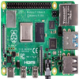
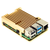
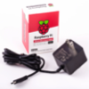
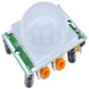
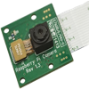
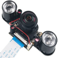
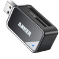
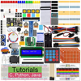
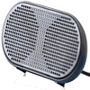
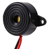

I've been wanting to dive deeper into Raspberry Pi development for a while but needed to make the time and find a project. Image classification using machine learning has been an interest so something using the motion sensor and camera sounded ideal.

As it turns out, my significant other's cat provided an opportunity to put those to use. The cat tends to go places that are off-limits such as the kitchen counter tops. Products like this [PetSafe SSSCAT Spray Deterrent](https://www.amazon.com/Innotek-PDT00-13914-Ssscat-Spray-Kit/dp/B000RIA95G) exist but require expensive compressed air cartridges and go off with any motion - pet, human, or otherwise. Another option is the [Echo Flex](https://www.amazon.com/Echo-Flex/dp/B07MLY3JKV) with the [motion sensor](https://www.amazon.com/Made-Amazon-THIRDREALITY-Motion-Sensor/dp/B07VF43BG1) - a time based automation routine can help in the kitchen or maybe a hallway outlet near a bedroom. Other options include fragrances or [custom mats](https://www.amazon.com/gp/product/B0001AB42W/ref=ppx_yo_dt_b_asin_title_o00_s00?ie=UTF8&psc=1) but they all leave something to be desired.

The goal for the project is simple:

1. Detect motion with Infrared sensor
2. Take pictures and/or video with a camera when motion is detected
3. Classify footage and determine if it's the cat
    - Not any cat but a specific cat
    - Using a previously trained machine learning model
4. If it's a match to the cat, perform relevant actions:
    - Play a startling noise to discourage the cat from restricted areas
    - Optionally send some form of notification

## Conceptual Overview

## Series Overview (In Progress)

Current and planned topics in this series are broken down into the following posts.

1. Raspberry Pi Cat Motion Siren (Project Overview)
2. [Scripting Raspberry Pi Image Builds](https://wp.me/p8RapM-Jf)
3. [Automating Raspberry Pi Setup](https://wp.me/p8RapM-K9)
4. [Deploying, Running, Debugging .NET Code on Raspberry Pi](https://wp.me/p8RapM-Kw)
5. [Deploying .NET Apps to Raspberry Pi with GitHub Actions and Docker](https://wp.me/p8RapM-MX)
6. [Raspberry Pi Infrared Motion Sensor with .NET](https://wp.me/p8RapM-Q0)
7. Capturing Images and Video with Raspberry Pi Cameras (Coming Soon)
8. Performing Image Classification on Raspberry Pi
9. Turning a Raspberry Pi into a Siren

## Tentative Hardware

It's worth noting that not all of the hardware listed below is strictly required for this project. Some of it was used just for evaluation or because I already had it handy and some planned items may not be used. Also some items listed individually can be bought cheaper as part of a bundle.

  

[Raspberry Pi 4 4GB](https://www.canakit.com/raspberry-pi-4-4gb.html) \- I use 2 of these, one that's a "clean" release / runtime target and another that's for dev debugging and experimentation. 1 is sufficient as are earlier Pi versions. 4 GB is overkill for runtime use but can be handy for dev debugging.  

  

Case(s) - I use an [Aluminium Heatsink Case](https://shop.pimoroni.com/products/aluminium-heatsink-case-for-raspberry-pi-4?variant=29430673211475) for heavier dev workloads and a [basic plastic case](https://www.canakit.com/raspberry-pi-4-case.html) for lighter runtime use.  

  

[Raspberry Pi 4 Power Supply](https://www.canakit.com/raspberry-pi-4-power-supply.html) \- one per Pi.  

  

[HC-SR501 Passive Infrared (PIR) Motion Sensor](https://www.amazon.com/DIYmall-HC-SR501-Motion-Infrared-Arduino/dp/B012ZZ4LPM) \- Various versions will do but this one is commonly used with Pi and Arduino and it's cheap and configurable.  

  

[Raspberry Pi Camera Module v 2.1](https://www.canakit.com/raspberry-pi-camera-v2-8mp.html?cid=usd&src=raspberrypi) \- I had an older 1.3 rev laying around and it works but image quality suffers.  

  

[MakerFocus Camera Night Vision Camera](https://www.amazon.com/gp/product/B06XYDCN5N/ref=ppx_yo_dt_b_asin_title_o01_s00?ie=UTF8&psc=1) \- Since the cat often goes off limits in the middle of the night, I tried this for camera footage in the dark.  

  

[SanDisk Industrial MicroSD Card (32 GB)](https://www.mouser.com/ProductDetail/?qs=1mbolxNpo8edRuxnvUaEMw%3D%3D) \- This industrial version is overkill but is ideal for long-running use and higher heat from the Pi. A [basic SD card](https://www.amazon.com/gp/product/B07F22Q6PN/ref=ppx_yo_dt_b_search_asin_title?ie=UTF8&psc=1) is fine. 32+ GB is a good size for storage of camera photos and videos.  

  

[MicroSD Card Reader](https://www.amazon.com/gp/product/B006T9B6R2/ref=ppx_yo_dt_b_search_asin_image?ie=UTF8&psc=1) \- Anything will do. I like the [this Anker](https://www.amazon.com/gp/product/B006T9B6R2/ref=ppx_yo_dt_b_search_asin_image?ie=UTF8&psc=1) but if space around ports is tight, [a smaller reader](https://www.canakit.com/mini-micro-sd-usb-reader.html) may be better though inserting and removing may not be as easy.  

  

[Freenove Ultimate Starter Kit](https://www.amazon.com/gp/product/B06W54L7B5/ref=ppx_yo_dt_b_asin_title_o09_s00?ie=UTF8&psc=1) \- Mostly just using miscellaneous items from this kit such as jumper cables but other relevant items include a breadboard, infrared motion sensor and more. Various similar kits exist.  

  

[HONKYOB USB Mini Speaker](https://www.amazon.com/gp/product/B075M7FHM1/ref=ppx_yo_dt_b_search_asin_title?ie=UTF8&psc=1) \- Mini speaker for the siren aspect to play audio louder.  

  

[UKCOCO Piezo Electronic Buzzer Alarm](https://www.amazon.com/gp/product/B07CNSQXXL/ref=ppx_yo_dt_b_search_asin_title?ie=UTF8&psc=1) \- Another evaluated option for the siren. Not near as loud as the mini speaker but much more compact.  

## Software / Tools / Tech

- [Visual Studio Code](https://code.visualstudio.com/)
- [Raspbian Buster Lite](https://www.raspberrypi.org/downloads/raspbian/)
- [ASP.NET Core 3.1](https://docs.microsoft.com/en-us/aspnet/core/?view=aspnetcore-3.1) and C#
- [Docker](https://www.docker.com/) and [Docker Hub](https://hub.docker.com/)
- Git, GitHub, and [Github Actions](https://github.com/features/actions)
- [Tensorflow .Net](https://github.com/SciSharp/TensorFlow.NET)
- Mac, Linux, and Bash scripts
- [MMALSharp](https://github.com/techyian/MMALSharp) for image capture
- [System.Device.Gpio](https://darenmay.com/blog/net-core-and-gpio-on-the-raspberry-pi---leds-and-gpio/)

## Up Next

[Scripting Raspberry Pi Image Builds](https://wp.me/p8RapM-Jf) - the next post in this series looks at automating the process of downloading Raspbian lite, extracting the image, formatting the SD card, copying the OS image, mounting / un-mounting / ejecting disks, configuring Wi-Fi and SSH, and more.
