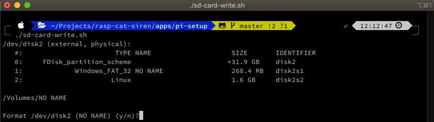
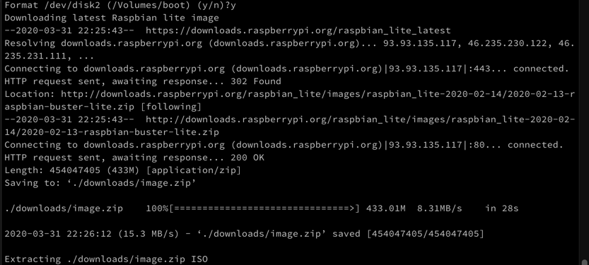
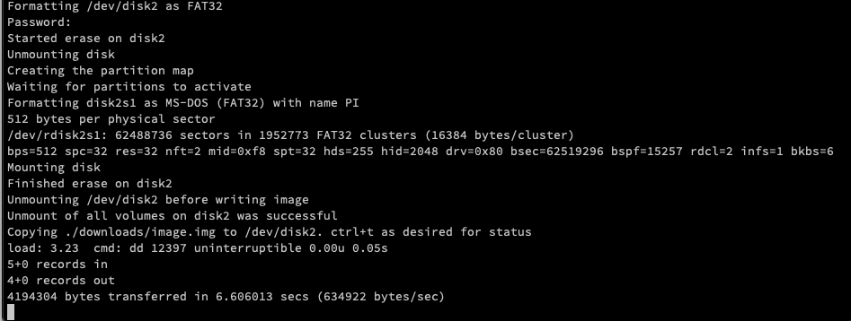

One of the first steps towards Raspberry Pi fun is installing a Raspberry Pi operating system image on an SD card and [this project](https://wp.me/p8RapM-Is) was no different. Initially it's common to use a GUI tool like the recently announced [Raspberry Pi Imager](https://www.raspberrypi.org/blog/raspberry-pi-imager-imaging-utility/) or [Balena Etcher](https://www.balena.io/etcher/). You might think this is more a one-time setup step but I found this happening more often for a few reasons:

1. Start fresh - Often I make temporary changes on the Pi while developing and debugging and want to start with a clean state to make sure I'm not relying on some manual change I'm likely to forget about later.
2. Multiple Raspberry Pi devices - While I'm not building a [Raspberry Pi Kubernetes Cluster](https://medium.com/@alexellisuk/five-years-of-raspberry-pi-clusters-77e56e547875) (yet), I've certainly gone through more than one Pi device. They're cheap and there are lots of project ideas and new models coming out.
3. SD Card upgrade - Sometimes I might start with a small SD card and later realize I need more storage.
4. SD Card failure - SD cards have a limited number of I/O operations and will eventually go bad, especially when opting for a cheap one.

As the need arose to repeatedly flash Pi SD cards, I wrote `sd-card-write.sh` to automate this on my Mac. Primary functions include:

- Gathering external disk info
- Downloading Raspbian Lite zip and extracting the image
- Formatting the SD card
- Copying the OS image to the SD card
- Dealing with disk mounting, unmounting, and ejection
- Configuring SSH and Wi-Fi
- Copying helper scripts that setup the Pi and pull application images

## Parameters

Currently the script just has 1 parameter for the final host name which is used to remove any prior ssh keys for the host and to set the host name in a setup script copied to the SD card.

\[bash\] #!/bin/sh

\# ./sd-card-write.sh --host catsirenpi

\# Final host name (not initial login) host\_name=""

while \[\[ $# -ge 1 \]\]; do i="$1" case $i in -h|--host) host\_name=$2 shift ;; \*) echo "Unrecognized option $1" exit 1 ;; esac shift done

if \[ -z "$host\_name" \]; then echo "Final Pi host name is required (-h | --host)" >&2 exit 1 fi \[/bash\]

## Gathering Disk Info

First the script gathers some information on external disks in order to confirm the disk to format without relying on the user to supply the disk name. It stops if it doesn't find 1 external disk, which suited my needs.

\[bash\] disk\_name=$(diskutil list external | grep -o '^/dev\\S\*') if \[ -z "$disk\_name" \]; then echo "Didn't find an external disk" ; exit -1 fi

matches=$(echo -n "$disk\_name" | grep -c '^') if \[ $matches -ne 1 \]; then echo "Found ${matches} external disk(s); expected 1" ; exit -1 fi

disk\_free=$(df -l -h | grep "$disk\_name" | egrep -oi '(\\s+/Volumes/.\*)' | egrep -o '(/.\*)') if \[ -z "$disk\_free" \]; then echo "Disk ${disk\_name} doesn't appear mounted. Try reinserting SD card" ; exit -1 fi

volume=$(echo "$disk\_free" | sed -e 's/\\/.\*\\///g')

\# Spit out disk info for user confirmation diskutil list external echo $disk\_free echo

read -p "Format ${disk\_name} (${volume}) (y/n)?" CONT if \[ "$CONT" = "n" \]; then exit -1 fi \[/bash\]

The above gets the script execution to this point:

It goes without saying but be extra sure that the right disk is being formatted!

## Download and Extraction

The next step is downloading the Raspbian Lite zip file and extracting the image from it.

\[bash\] image\_path=./downloads image\_zip="$image\_path/image.zip" image\_iso="$image\_path/image.img"

\# Consider checking latest ver/sha online, download only if newer # https://downloads.raspberrypi.org/raspbian\_lite/images/?C=M;O=D # For now just delete any prior download zip to force downloading latest version if \[ ! -f $image\_zip \]; then mkdir -p ./downloads echo "Downloading latest Raspbian lite image" # curl often gave "error 18 - transfer closed with outstanding read data remaining" wget -O $image\_zip "https://downloads.raspberrypi.org/raspbian\_lite\_latest"

if \[ $? -ne 0 \]; then echo "Download failed" ; exit -1; fi fi

echo "Extracting ${image\_zip} ISO" unzip -p $image\_zip > $image\_iso

if \[ $? -ne 0 \]; then echo "Unzipping image ${image\_zip} failed" ; exit -1; fi \[/bash\]

## Flashing the Disk

The disk is then formatted and unmounted so the image can be copied to it.

\[bash\] echo "Formatting ${disk\_name} as FAT32" sudo diskutil eraseDisk FAT32 PI MBRFormat "$disk\_name"

if \[ $? -ne 0 \]; then echo "Formatting disk ${disk\_name} failed" ; exit -1; fi

echo "Unmounting ${disk\_name} before writing image" diskutil unmountdisk "$disk\_name"

if \[ $? -ne 0 \]; then echo "Unmounting disk ${disk\_name} failed" ; exit -1; fi \[/bash\]

[Data duplicator (dd)](https://ss64.com/osx/dd.html) is used to copy the image to the SD card. This takes a while but pressing `ctrl+t` can be done at any time for progress. Depending upon the machine, the `bs` argument (I/O block size) might need adjusting from the 1 MB value used here.

\[bash\] echo "Copying ${image\_iso} to ${disk\_name}. ctrl+t as desired for status" sudo dd bs=1m if="$image\_iso" of="$disk\_name" conv=sync

if \[ $? -ne 0 \]; then echo "Copying ${image\_iso} to ${disk\_name} failed" ; exit -1 fi \[/bash\]

## Configuring SSH and Wi-Fi

After the image is written the script remounts the drive to make some modifications - namely writing files to enable SSH and Wi-Fi and to copy over some helper scripts. It also does some cleanup by deleting the image file; currently it leaves the zip to avoid downloading again later - it's easy enough to just delete the zip to force a new download if a later version is published.

The loop and sleep commands are a failsafe as sometimes there are timing issues from the copy and the disk is not yet ready for mounting again.

\[bash\] # Remount for further SD card mods. Drive may not be quite ready. attempt=0 until \[ $attempt -ge 3 \] do sleep 2s echo "Remounting ${disk\_name}" diskutil mountDisk "$disk\_name" && break attempt=$\[$attempt+1\] done

echo "Removing ${image\_iso}. Re-extract later if needed from ${image\_zip}" rm $image\_iso \[/bash\]

Enabling SSH is as simple as writing a `ssh` file to the SD card root.

\[bash\] volume="/Volumes/boot"

echo "Enabling ssh" touch "$volume"/ssh

if \[ $? -ne 0 \]; then echo "Configuring ssh failed" ; exit -1 fi \[/bash\]

I didn't want to use a wired connection or plug in a monitor so the script determines the current host WiFi network name (SSID) and then prompts for the password. Afterwards it writes the Wi-Fi credentials to [wpa\_supplicant.conf](https://linux.die.net/man/5/wpa_supplicant.conf) on the SD card root.

\[bash\] echo "Configuring Wi-Fi" wifi\_ssid=$(/System/Library/PrivateFrameworks/Apple80211.framework/Resources/airport -I | awk -F: '/ SSID/{print $2}') wifi\_ssid=\`echo $wifi\_ssid | sed 's/^ \*//g'\` # trim

echo "Wi-Fi password for ${wifi\_ssid}:" read -s wifi\_pwd

cat >"$volume"/wpa\_supplicant.conf <<EOL ctrl\_interface=DIR=/var/run/wpa\_supplicant GROUP=netdev update\_config=1 country=US

network={ ssid="${wifi\_ssid}" psk="${wifi\_pwd}" } EOL

if \[ $? -ne 0 \]; then echo "Configuring wifi failed" ; exit -1 fi \[/bash\]

## Copying Scripts and Disk Ejection

After the configuration, the script copies previously written script files that help further setup the Pi by installing apps and updates, setting configuration, and pulling application Docker images (more on these scripts in upcoming posts). After the copy operations the disk is ejected.

\[bash\] echo "Copying setup script. After Pi boot, run: sudo /boot/setup.sh" cp setup.sh "$volume"

echo "Modifying setup script" # Replace "${host}" placeholder in the setup script on SD card with final host name passed to script sed -i -e "s/\\${host}/${host\_name}/" "$volume/setup.sh"

echo "Copying docker pull script for app updates" cp pull.sh "$volume"

echo "Image burned. Remove SD card, insert in PI and power on" sudo diskutil eject "$disk\_name" \[/bash\]

## SSH Prep

Finally the script uses [ssh-keygen](https://man.openbsd.org/ssh-keygen.1) to remove any prior keys to the target Pi host. Otherwise there'd be issues connecting to the same device that's been re-flashed.

\[bash\] echo "Removing any prior PI SSH known hosts entry" ssh-keygen -R raspberrypi.local # initial ssh-keygen -R "$host\_name.local"

echo "Power up the PI and give it a minute then" echo " ssh pi@raspberrypi.local" echo " yes, raspberry" echo " sudo /boot/setup.sh" \[/bash\]

The initial ssh might generate `Connection refused` until the Pi is fully ready, which might be up to a minute or so after powering on. A monitor has the advantage of seeing what's happening here but that hookup isn't worth the hassle for me. If the ssh hangs, the Wi-Fi configuration details may be incorrect.

## Source

The full script can be found here: [sd-card-write.sh](https://github.com/thnk2wn/rasp-cat-siren/blob/master/pi-setup/sd-card-write.sh).

## Other Automation Options

Another option of interest is using [pi-gen](https://github.com/RPi-Distro/pi-gen) to create pre-configured Pi images. It has a number of [configuration options](https://github.com/RPi-Distro/pi-gen#config) like setting the default username and password, locale info, Wi-Fi and SSH details, host name and more. I ended up doing that later on [here](https://github.com/thnk2wn/rasp-cat-siren/tree/master/pi-setup/pi-gen). See [Using Pi-Gen to Build a Custom Raspbian Lite Image](https://geoffhudik.com/tech/2020/05/15/using-pi-gen-to-build-a-custom-raspbian-lite-image/) for more on this approach.

## Up Next

[Automating Raspberry Pi Setup](https://wp.me/p8RapM-K9) - The next post in [this series](https://wp.me/p8RapM-K9) covers automating Raspberry Pi system configuration and installing applications.
