\[toc wrapping="right"\]

## Overview

In working with [Azure IoT Edge](https://azure.microsoft.com/en-us/services/iot-edge/), I wanted to evaluate dynamically creating a Linux VM to perform automated integration testing against - perhaps one spun up and torn down within CI/CD or otherwise short-lived for ad-hoc testing. There are a number of ways to do this but I decided to give [Pulumi](https://www.pulumi.com/) a shot. I started to try it out back in Beta but never really used it and with [version 2.0 launching](https://www.pulumi.com/blog/pulumi-2-0/) I thought it was time. While I briefly used [Terraform](https://www.terraform.io/) on a [GCP](https://cloud.google.com/) project with success, I was attracted to the Pulumi approach of existing languages and tooling over a DSL and how it handles state and concurrency by default.

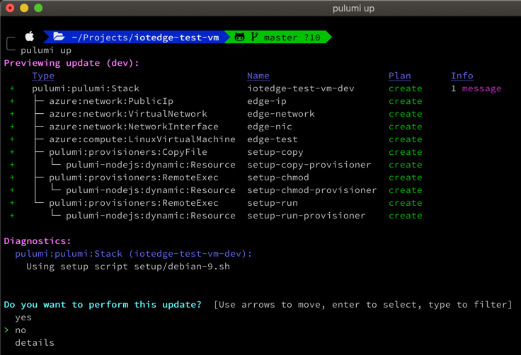

## Getting Started

### Installation

I'm on Mac so I installed Pulumi through [Homebrew](https://brew.sh/) but Windows and Linux installs are just as quick.

\[bash\] brew install pulumi \[/bash\]

Next a language runtime may need to be installed if not already present. Although I'm more of a .NET guy and [Pulumi supports .NET](https://www.pulumi.com/docs/intro/languages/dotnet/), I took the [Pulumi Node.js](https://www.pulumi.com/docs/intro/languages/javascript/) route because:

- Feels faster and more lightweight to avoid full compilation
- Most of the examples seem to be in TypeScript / JavaScript
- My use case is small and time is short

It's worth checking `node --version` and `brew outdated`. The first computer I did this on had v14.0.0 and worked well. A nearly identical project on another machine gave me an error `Cannot find module 'http2'` at runtime then I realized it had an ancient version of node - 8.3.0. I also had [some difficulties upgrading Node](https://stackoverflow.com/questions/31691626/cant-brew-install-node) but once upgraded it worked. Pulumi supports [Current, Active and Maintenance LTS versions](https://nodejs.org/en/about/releases/).

I'm a bit surprised that PowerShell isn't officially supported yet. This type of work has been done in Windows PowerShell for years and with PowerShell switching to .NET Core and being cross platform it feels like a no-brainer. With Pulumi supporting .NET more recently I suspect it may be coming before long; there's some [PS discussion here](https://github.com/pulumi/pulumi/issues/3507).

For Pulumi Azure integration, [Azure CLI](https://docs.microsoft.com/en-us/cli/azure/install-azure-cli?view=azure-cli-latest) needs to be installed. This particular project also needs the Azure IoT Extension.

\[code\] brew update && brew install azure-cli az extension add --name azure-cli-iot-ext \[/code\]

### Azure Resource Setup

This project assumes a resource group and IoT hub have been previously setup in Azure, along with a virtual test device identity.

\[bash\] # Create dev resource group az group create -l westus -n dev

\# Create IoT hub standard pricing tier az iot hub create --resource-group dev --name pulumi-iot-test --location westus

\# Create Edge test device identity az iot hub device-identity create --hub-name pulumi-iot-test --device-id edge-test --edge-enabled

\# Get hub connection string for this device: az iot hub device-identity show-connection-string --hub-name pulumi-iot-test --device-id edge-test \[/bash\]

### Starting a Project

Before starting a Pulumi project, it's helpful to consider [State and Backends](https://www.pulumi.com/docs/intro/concepts/state/). Like Terraform, there is infrastructure state Pulumi will store for diffs / changes, cleanup etc. By default the CLI will use Pulumi's backend at [app.pulumi.com](https://app.pulumi.com). That's free for basic features like storing the state and viewing history of infrastructure changes. Personally I love that but it's also possible to store that state on your own file system or cloud blob storage. Either way, it's good to consider all options and know what's happening behind the scenes before starting.

\[bash\] mkdir iotedge-test-vm && cd iotedge-test-vm pulumi new azure-typescript \[/bash\]

Initially that will direct to [app.pulumi.com](https://app.pulumi.com) with various methods to sign in or create an account. I chose GitHub then clicked `New Access Token`, gave it a name and copied it, then pasted it back in the terminal.

After a few basic questions with defaults, the files are created and NPM packages restored. The [Pulumi Stack](https://www.pulumi.com/docs/intro/concepts/stack/) is an isolated instance, often representing an environment, and it defaults to `dev`.

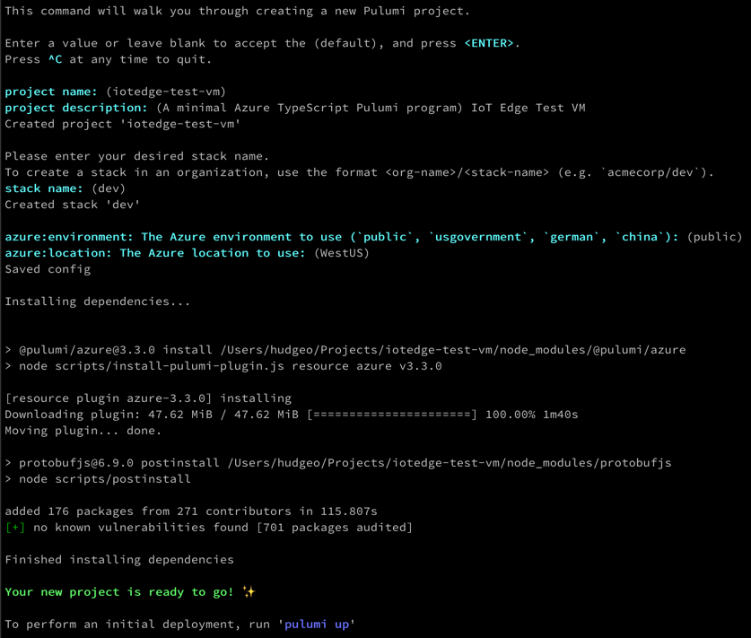

## Configuration Settings

### Azure Settings

Before running anything, thought should be given to credentials. If you have the permissions in the target account, a simple `az login` may be enough if not already logged in. In my case I didn't have all the necessary permissions and I was considering using [Pulumi within CI/CD](https://www.pulumi.com/docs/guides/continuous-delivery/) shortly if all went well. I recently created a service principal with `az ad sp create-for-rbac --name AppName` so I plugged those values into Pulumi as follows.

\[bash\] pulumi config set azure:clientId {clientId} pulumi config set azure:clientSecret {clientSecret} --secret pulumi config set azure:tenantId {tenantId} pulumi config set azure:subscriptionId {subscriptionId} \[/bash\]

These get stored in the current Pulumi stack yaml file - in this case, `Pulumi.dev.yaml`.

\[yaml\] config: azure:clientId: {guid} azure:clientSecret: secure: {longEncryptedString} azure:environment: public azure:location: WestUS azure:subscriptionId: {guid} azure:tenantId: {guid} \[/yaml\]

Environment variables can also be used if preferable - for example `ARM_CLIENT_ID`. See [Service Principal Authentication](https://www.pulumi.com/docs/intro/cloud-providers/azure/setup/#service-principal-authentication) for details.

### General Configuration Settings

General, custom configuration settings for specific needs of the Pulumi project can be set in a similar fashion. For example, setting the username and password of the VM to be created.

\[bash\] pulumi config set username edge pulumi config set password $EDGE\_PASS --secret \[/bash\]

The project name (from `pulumi new` in `Pulumi.yaml`) is prefixed to the keys.

\[yaml\] config: iotedge-test-vm:password: secure: AAABAFK33ZU2WcrwfmTl4EN5gWS6KOgcZwhv608nQt626xmzB94G2rt/ iotedge-test-vm:username: edge \[/yaml\]

[Structured configuration](https://www.pulumi.com/docs/intro/concepts/config/#structured-configuration) is also available.

The YAML can be directly hand-edited to do the same but the CLI has the added benefit of encryption for secrets. It'll even warn you if you forget to add `--secret` and the setting looks like it might be secret in nature. It also appears to keep the YAML tidy, for example it seems to sort by key. If editing by hand, a text editor [YAML extension](https://marketplace.visualstudio.com/items?itemName=redhat.vscode-yaml) may be helpful for validation. There's more in [Pulumi Configuration and Secrets](https://www.pulumi.com/docs/intro/concepts/config/); it can work with [Azure Key Vault](https://azure.microsoft.com/en-us/services/key-vault/) for example.

## Using Pulumi

Before diving too deep into the coding, it's helpful to review Pulumi's [Architecture & Concepts](https://www.pulumi.com/docs/intro/concepts/), especially the [Pulumi programming model](https://www.pulumi.com/docs/intro/concepts/programming-model/).

### Creating the VM and Related Resources

My project is based off the [Web Server Using Azure Virtual Machine](https://www.pulumi.com/docs/tutorials/azure/azure-ts-webserver/) example. I made some changes to [upgrade it to Pulumi 2.0](https://www.pulumi.com/blog/pulumi-azure-2-0/) and customized it from there.

When the project was created, it generated `index.ts` for the entry point (see also `package.json` and `tsconfig.json`). I replaced the default generated code with the above example initially. After modifications, it starts off with common imports, config values, and resource tags. I'll touch on the `provisioners` import shortly.

\[javascript\] import \* as azure from "@pulumi/azure"; import \* as pulumi from "@pulumi/pulumi"; import \* as provisioners from "./provisioners";

const config = new pulumi.Config();

// Common config values used in multiple spots const hostName = config.require("host"); const hostUser = config.require("username"); const hostPassword = config.requireSecret("password"); const resourceGroupName = config.require("resourceGroup"); const location = config.require("location");

let tags = { category: "iot", dynamic: "true", name: hostName, subcategory: "edge" } \[/javascript\]

Next the virtual network details are setup. I chose to explicitly set the location (using my own custom `location` setting) for each resource as Pulumi didn't seem to use the default `azure:location` value but I may have been doing something wrong.

\[javascript\] const network = new azure.network.VirtualNetwork("edge-network", { resourceGroupName, addressSpaces: \["10.0.0.0/16"\], location: location, subnets: \[{ name: "default", addressPrefix: "10.0.1.0/24", }\], tags: tags });

const publicIp = new azure.network.PublicIp("edge-ip", { resourceGroupName, allocationMethod: "Dynamic", location: location, tags: tags });

const networkInterface = new azure.network.NetworkInterface("edge-nic", { resourceGroupName, ipConfigurations: \[{ name: "edge-ip-cfg", subnetId: network.subnets\[0\].id, privateIpAddressAllocation: "Dynamic", publicIpAddressId: publicIp.id, }\], location: location, tags: tags }); \[/javascript\]

For creating the VM, I chose Debian since it's a bit closer to the OS on the IoT devices. I went with version 9 as that's the latest version Azure IoT Edge had some support / releases for; version 10 may work but has a conflict around OpenSSL. The following config values are used for the VM; see [Cloud/MicrosoftAzure](https://wiki.debian.org/Cloud/MicrosoftAzure) on Debian's WIKI for image details.

\[yaml\] config: iotedge-test-vm:imageOffer: Debian iotedge-test-vm:imagePublisher: credativ iotedge-test-vm:imageSku: "9" iotedge-test-vm:size: Standard\_A0 \[/yaml\]

The [LinuxVirtualMachine](https://www.pulumi.com/docs/reference/pkg/dotnet/Pulumi.Azure/Pulumi.Azure.Compute.LinuxVirtualMachine.html) resource is new in V2 and a bit easier than than the deprecated `VirtualMachine`. The custom timeouts step is important - a later script provisioning step can potentially hang so this limit is a safety net, especially for CI/CD use.

\[javascript\] const vm = new azure.compute.LinuxVirtualMachine(hostName, { resourceGroupName, networkInterfaceIds: \[networkInterface.id\], size: config.require("size"), sourceImageReference: { publisher: config.require("imagePublisher"), offer: config.require("imageOffer"), sku: config.require("imageSku"), version: "latest", }, osDisk: { caching: "ReadWrite", storageAccountType: "Standard\_LRS", }, computerName: hostName, adminUsername: hostUser, adminPassword: hostPassword, disablePasswordAuthentication: false, location: location, tags: tags, }, { customTimeouts: { create: "10m" } }); \[/javascript\]

So far that's all pretty standard. Next I wanted the VM provisioned immediately after creation with the required software and configuration.

### Provisioning, Waiting, and Outputs

I setup provisioning based on [Provisioning with Dynamic Providers](https://www.pulumi.com/blog/architecture-as-code-vm/#provisioning-with-dynamic-providers) and [AWS WebServer with Manual Provisioning](https://github.com/pulumi/examples/tree/master/aws-ts-ec2-provisioners). Essentially [scp2](https://www.npmjs.com/package/scp2) is used to copy a setup script to the VM on creation and [ssh2](https://www.npmjs.com/package/ssh2) is used to make it executable and run it. I won't repeat the code for the provisioners here as it's in those examples and my sample repo. I was getting some errors with direct use of that code so I had to upgrade package versions and at least temporarily turn off strict mode in `tsconfig.json`. I also modified the ssh code to add [log.info()](https://www.pulumi.com/docs/reference/pkg/nodejs/pulumi/pulumi/log/) calls to see output as it was run.

First the setup script is copied to the VM. I added a configuration parameter for which to use as I switched between Ubuntu Server, Debian 9, and Debian 10 and some steps varied slightly between distros.

\[javascript\] const conn = { host: vm.publicIpAddress, username: hostUser, password: hostPassword };

const setupScript = \`setup/${config.require("setupScript")}.sh\`; console.log(\`Using setup script ${setupScript}\`);

// Copy setup script to server const cpSetupScript = new provisioners.CopyFile("setup-copy", { conn, src: setupScript, dest: "setup.sh", }, { dependsOn: vm });

// Make setup script executable const chmodSetup = new provisioners.RemoteExec("setup-chmod", { conn, command: "chmod 755 setup.sh ", }, { dependsOn: cpSetupScript }); \[/javascript\]

The script is then executed over ssh. See the notes following the code.

\[javascript\] const hubConn = config.requireSecret("hubConnection");

const secrets = pulumi.all({ hubConn, hostPassword });

secrets.apply(s => { // Run setup script to install IoT Edge and otherwise configure machine let command = \`echo "${s.hostPassword}" | sudo -S ./setup.sh --hub "${s.hubConn}"\`; new provisioners.RemoteExec("setup-run", { conn, command: command, }, { dependsOn: chmodSetup }); }); \[/javascript\]

Notes:

- Permissions - the script requires sudo but the execution can't prompt for a password so the password is passed via stdin. There may be a better way to handle this.

- Secrets and `.apply()` - initially I tried directly using the secret values but found sudo wasn't getting the password. Then I tried `hostPassword.get()` and received the error `Cannot call '.get' during update or preview. To manipulate the value of this Output, use '.apply' instead.` That wasn't immediately intuitive as I didn't consider the password an output - it's logically an input. Technically though `.requireSecret()` is an output as it has to go through the decryption process.

Currently the provisioning process feels like a workaround. It requires more custom code than should be needed, it can hang (or appear to), script permissions can be awkward, and getting the output doesn't feel ideal. It does look like [a better script and command provisioning model](https://github.com/pulumi/pulumi/issues/99) is being considered / in the works.

Finally the script waits for the VM to be created and exposes the public IP and physical name of the host.

\[javascript\] // The public IP address is not allocated until the VM is running, so wait for that // resource to create, and then lookup the IP address again to report its public IP. const done = pulumi.all({ \_: vm.id, name: publicIp.name, resourceGroupName: publicIp.resourceGroupName, });

export const ipAddress = done.apply(d => { let ip = azure.network.getPublicIP({ name: d.name, resourceGroupName: d.resourceGroupName, }, { async: true }).then(ip => ip.ipAddress);

return ip; });

export let physicalName = vm.name;

// Get ip address, ssh // ssh user@$(pulumi stack output ipAddress) \[/javascript\]

### Running

The project can be run with `pulumi up`. Adding `--yes` on subsequent runs can save time if you don't need the preview at times.

While it's running the last thing logged can be seen, which in my case was mostly the ssh script execution output written with the [log module](https://www.pulumi.com/docs/reference/pkg/nodejs/pulumi/pulumi/log/) (similar with console.log). I thought I could run [pulumi logs -f](https://www.pulumi.com/docs/reference/cli/pulumi_logs/) and follow/tail logs but that didn't generate any output for me; I'm guessing that's another stream used by other modules.

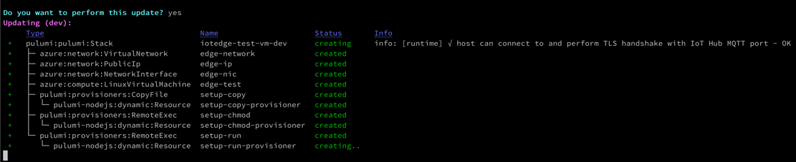

Later I realized I could open [app.pulumi.com](https://app.pulumi.com), open the in-progress activity, and see the logs update in near real time. It is a little awkward though as the output panel keeps growing and you have to keep scrolling down. The "tailing" experience there could be improved.

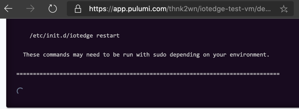

Once finished, the combined output is written and any [stack outputs](https://www.pulumi.com/docs/intro/concepts/programming-model/#stack-outputs) are shown.

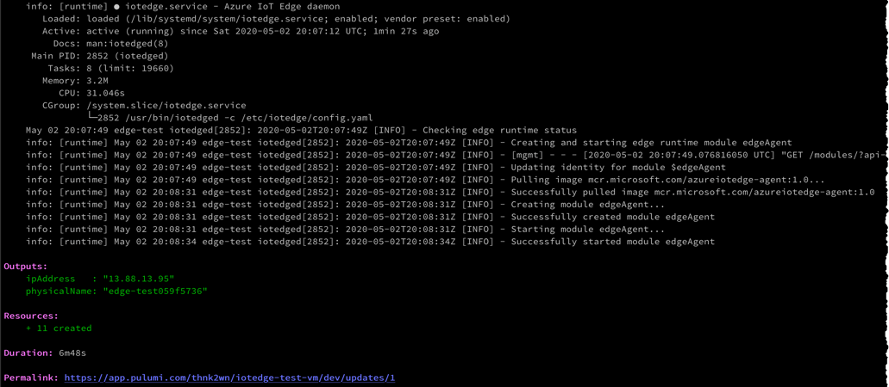

### Verifying the Results

Afterwards the VM and its associated resources show in the Azure Portal as expected.

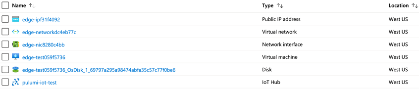

Then after grabbing the IP from the console output or `pulumi stack output ipAddress`, an ssh into the VM helps verify the setup.

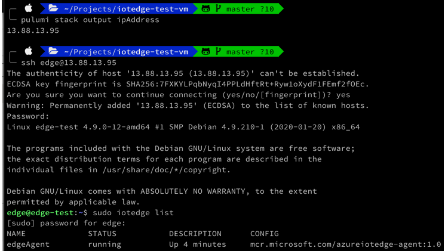

### Partial Changes

After making some changes to the setup script I wanted to recreate the VM but not its related resources. First I removed the VM.

\[bash\] az vm delete -y -g dev -n edge-test059f5736 \[/bash\]

Afterwards I ran `pulumi up` but it didn't show any changes. After some digging I realized I had to run [pulumi refresh](https://www.pulumi.com/docs/reference/cli/pulumi_refresh/) to compare the stack state with the current Azure state and sync Pulumi's state. This is different than Terraform's behavior where the plan / preview step would implicitly do this. I didn't find it intuitive or mentioned in intro docs but I'm sure there's valid reasons.

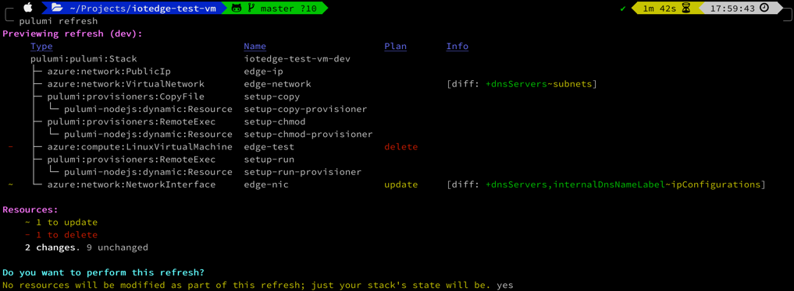

In the next `pulumi up`, just the VM was picked up for recreation, as expected. The copy, chmod, and setup script steps are done again as well since they depend on the VM step that was recreated. Overall time doesn't go down that much but it does help.

There is a problem however - since I just deleted the VM and not the disk, when Pulumi re-created the VM a new disk was created and the old was left orphaned. So I probably should've deleted both the VM and the disk at a minimum. At that point though, blowing away all the stack resources and recreating them all may make more sense.

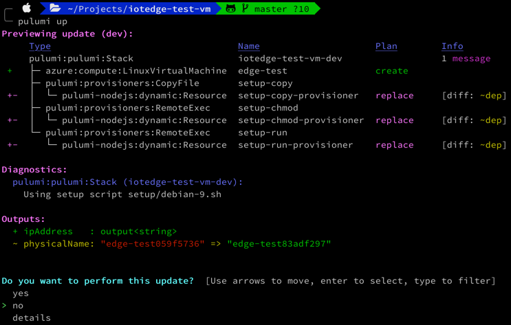

### Teardown

Running `pulumi destroy` deletes all the stack resources. As it indicates, the stack itself and its history remain by default.

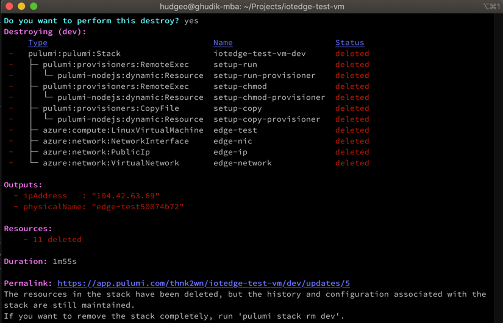

### Viewing History

Seeing all the infrastructure run history in [app.pulumi.com](https://app.pulumi.com) is great and I like the git integration. With paid team plans multiple users can collaborate on the site, get unlimited deployment history, severals stacks, and more. There's quite a bit of value provided in the free community edition though.

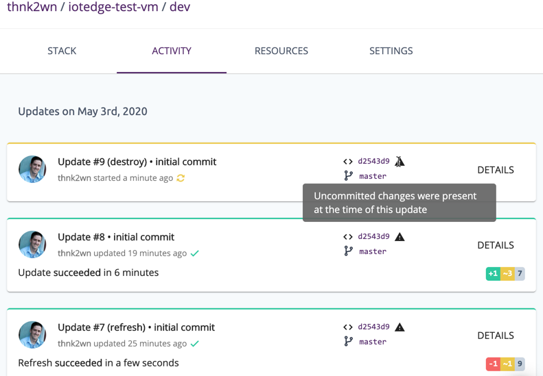

### Troubleshooting

At some point there may be an error with some leftover pending operation. In my case this was always due to some script error that appeared to cause the process to hang and I had to ctrl+c to cancel. The error is along the lines of `the current deployment has {X} resource(s) with pending operations... refusing to proceed`. In this case I would resolve as follows.

- Run `pulumi stack export >state.json`.
- Search / locate `pending_operations: []` near end of the file. Review, remove content inside, save.
- Run `pulumi stack import --file state.json && rm state.json`.
- Re-run the up or destroy operation.

That worked but I can envision a smoother way of removing pending operations / reconciling state via the CLI only.

### Going further

This VM example is pretty simple but you can imagine creating [resource providers](https://www.pulumi.com/docs/intro/concepts/programming-model/#providers) and reusable modules in your languages and tooling of choice and sharing and reusing those across applications, environments and teams. Leveraging all the capabilities of modern programming languages can be a lot more flexible and powerful than custom DSLs and configuration files.

### Initial Impressions

I've only used Pulumi for a few days now and my current use case is small so I've only scratched the surface but my initial impression is positive.

Really liked:

- Programming model
- Language support (minus PowerShell)
- Supported cloud providers
- CLI worked well
- Love the state syncing by default to app.pulumi.com
- The app.pulumi.com website felt polished
- Mostly just worked, fairly intuitive
- Quite a bit is offered for free

Could be better:

- Provisioning with appropriate software and configuration could use 1st class support. Dynamic ssh command setup felt brittle and too much custom setup.
- Lack of official PowerShell support is a bummer.
- Documentation felt lacking in places.
- [Azure Compute Module](https://www.pulumi.com/docs/reference/pkg/nodejs/pulumi/azure/compute/) uses [Terraform's Provider for Azure](https://github.com/terraform-providers/terraform-provider-azurerm) so it still feels tied to Terraform from a docs, issue, and support perspective.
- I didn't find logging and diagnostics to be completely clear. There's a log module and `console.log` and neither showed up in `pulumi logs`. Logs from dynamic provisioning through SSH aren't ideal (i.e. progress output, single character output).
- It'd be nice to see more real-world examples and with more language parity (heavy JS/TS).
- A few things didn't feel intuitive such as `pulumi refresh`, accessing secrets, or logging.

All in all I've been happy with my Pulumi experience so far. Supporting the combination of multiple cloud providers, languages, resource types, operating systems, and SDK / API versions is no easy feat.

## IoT Edge Specifics

### Setup Script

The `debian-9.sh` setup script starts with a parameter for the IoT hub connection string and then outputs some OS info.

\[bash\] #!/bin/bash

hub\_connection=""

while \[\[ $# -ge 1 \]\]; do i="$1" case $i in -h|--hub) hub\_connection=$2 shift ;; \*) echo "Unrecognized option $1" exit 1 ;; esac shift done

if \[ -z "$hub\_connection" \]; then echo "Hub connection is required (-h | --hub)" >&2 exit 1 fi

\# Output host info uname -a lscpu \[/bash\]

Some system updates are then applied. I would occasionally get some locking errors around apt lists. I'm not entirely positive why; my guess is a timing issue on the VM being fully ready or something else initiating `apt update` or `apt upgrade` at the same time.

\[bash\] echo "Updating system" apt update && apt upgrade

if \[ $? -ne 0 \]; then # E: Could not get lock /var/lib/apt/lists/lock - open (11: Resource temporarily unavailable) ps aux | grep '\[a\]pt'

attempt=0 until \[ $attempt -ge 5 \] do sleep 5s echo "Retrying updating package lists" apt update && apt upgrade && break attempt=$\[$attempt+1\] done fi \[/bash\]

Required packages are then installed. Unlike on a Rasbian ARM device, apt-get couldn't be used on the Linux VM for IoT Edge packages since those packages aren't published there. Getting the right [IoT Edge release](https://github.com/Azure/azure-iotedge/releases) manually is a bit tedious since there's no flat list and not every package is published with every release; it can require digging through many releases and copying several links for the right host and processor architecture.

\[bash\] echo "Installing curl" apt-get -y install curl

echo "Installing repository configuration" curl https://packages.microsoft.com/config/debian/stretch/multiarch/prod.list > ./microsoft-prod.list cp ./microsoft-prod.list /etc/apt/sources.list.d/

echo "Installing gpg for public key" apt-get -y install gnupg

echo "Installing the Microsoft GPG public key" curl https://packages.microsoft.com/keys/microsoft.asc | gpg --dearmor > microsoft.gpg cp ./microsoft.gpg /etc/apt/trusted.gpg.d/

\# IoT Edge can't be installed via apt-get here since this is a Tier 2 linux VM and not Tier 1 target device.

echo "Installing Moby Engine" curl -L \\ https://github.com/Azure/azure-iotedge/releases/download/1.0.7/moby-engine\_3.0.5\_amd64.deb \\ -o moby\_engine.deb \\ && dpkg -i ./moby\_engine.deb

echo "Installing Moby CLI" curl -L \\ https://github.com/Azure/azure-iotedge/releases/download/1.0.7/moby-cli\_3.0.5\_amd64.deb \\ -o moby\_cli.deb \\ && dpkg -i ./moby\_cli.deb

echo "Installing IoT Edge hsmlib and security daemon" curl -L \\ https://github.com/Azure/azure-iotedge/releases/download/1.0.9/libiothsm-std\_1.0.9-1-1\_debian9\_amd64.deb \\ -o libiothsm-std.deb \\ && dpkg -i ./libiothsm-std.deb

curl -L \\ https://github.com/Azure/azure-iotedge/releases/download/1.0.9/iotedge\_1.0.9-1\_debian9\_amd64.deb \\ -o iotedge.deb \\ && dpkg -i ./iotedge.deb \[/bash\]

Finally some Edge-specific system configuration and readiness checks are done and the script cleans up some temporary resources.

\[bash\] # Certs expire after 90 days but may not need to setup if VM is being created each time. # https://docs.microsoft.com/en-us/azure/iot-edge/how-to-install-production-certificates

\# Configure the Security Daemon # TODO: Device Provisioning Service instead of manual configuration configFile=/etc/iotedge/config.yaml

\# wait to set connection string until config.yaml is available until \[ -f $configFile \] do sleep 2 done

sed -i "s#\\(device\_connection\_string: \\).\*#\\1\\"$hub\_connection\\"#g" $configFile # TODO: update certificate paths in config file if certs are created later

dockerPath=/etc/docker

\[\[ -d $dockerPath \]\] || mkdir $dockerPath

cat > $dockerPath/daemon.json <<EOL { "dns": \[ "{ip1}", "{ip2}" \],

"log-driver": "json-file",

"log-opts": { "max-size": "5m", "max-file": "3" } } EOL

\# After configuration is done, restart iotedge systemctl restart iotedge

\# After a restart, run checks on configuration, connectivity... iotedge check

\# Check status of IoT Edge Daemon systemctl status iotedge

\# Cleanup temporary downloaded items that were installed / copied elsewhere rm iotedge.deb libiothsm-std.deb microsoft.gpg microsoft-prod.list moby\_cli.deb moby\_engine.deb \[/bash\]

### Processor Architecture

It's likely that IoT Edge modules are being built for ARM devices like the Raspberry Pi. As such, those module Docker images aren't going to work on a Linux VM like Debian with an x86\_64 processor architecture. Performing system integration testing then means building each module twice - once for ARM32v7 and again for amd64 for a test VM. It also means doing a separate deployment that uses the amd64 module images instead of the ARM ones.

This isn't ideal because the tests won't be against the exact same images. However the code is the same along with much of the configuration so it's still useful for end to end smoke tests before deploying to real devices. In addition to the module testing, it can also be useful to spin up a VM just to test parts of the IoT Edge setup process, even though that will also vary some between a VM and physical ARM device.

It might be tempting to forward kernel requests for ARM instructions to x86\_64 via:

\[bash\] docker run --rm --privileged multiarch/qemu-user-static:register --reset \[/bash\]

That will get by the execution format error but will result in `[/usr/share/dotnet/host/fxr] does not contain any version-numbered child folders` since [can't run .NET within arm32 images on amd hosts](https://github.com/dotnet/dotnet-docker/issues/1537#issuecomment-615269150).

Ideally an ARM VM might be nice but since you can't run a VM with a different architecture than the host, emulation is the only option. It's possible to have a [Linux VM with QEMU setup](http://azeria-labs.com/arm-lab-vm/) and that might be fine for experimentation but likely too slow and cumbersome for running anything real.

For more real-world testing, having one or more physical ARM IoT devices as dedicated CI/CD testing devices can be more helpful. Some care has to be taken that these are secured, only allowing connectivity to Azure IoT hub and that the devices are somewhere safe where they're always powered on and they aren't being used for anything other than automated integration tests.

### Integration Tests

Currently I'm doing unit tests of module logic in the Edge Module CI/CD builds per module repo. Integration tests would happen in CI/CD builds for the repo housing the deployment template configuration post-deployment. I haven't started the integration tests themselves yet but the thought is they would be run on a build agent (or other test host) and not on this virtual Edge test VM. The basic idea is:

1. After an Edge deployment, wait on successful deployment. Keep querying [Edge Agent reported properties](https://docs.microsoft.com/en-us/azure/iot-edge/module-edgeagent-edgehub) for a set time to verify the new module versions were installed.

3. Connect to a module and invoke a direct method (i.e. update firmware).

5. Verify that the method execution started okay and returned a valid start result.

7. Wait a set amount of time, listen for reported property changes.

9. Verify that reported properties were set correctly indicating the device applied the desired change correctly.

11. Repeat steps per module, performing high level smoke tests via interaction of direct method calls and module twin desired / reported properties.

## Source / Sample Repo

This project is available at [https://github.com/thnk2wn/pulumi-azure-vm-iot-edge](https://github.com/thnk2wn/pulumi-azure-vm-iot-edge).
