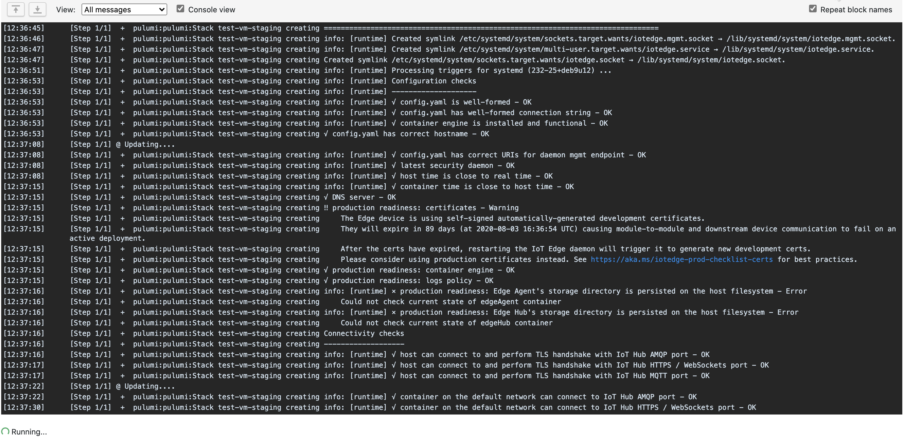

After [setting up Pulumi to build an Azure VM](https://geoffhudik.com/tech/2020/05/03/use-pulumi-to-create-and-provision-an-azure-vm-for-iot-edge/), I wanted to try incorporating it into a [TeamCity](https://www.jetbrains.com/teamcity/) CI/CD process.

The [Pulumi TeamCity doc](https://www.pulumi.com/docs/guides/continuous-delivery/teamcity/) details the installation steps such as installing Node.js. In my case however the target build agents are used by many different applications so I'm hesitant to install or mess with system configuration there unless I have to. When I noticed a very old version of Node.js on the agent I decided to search Docker Hub. While I don't recall seeing it mentioned on the Pulumi site, I was happy to see a [Pulumi CLI Docker Image](https://hub.docker.com/r/pulumi/pulumi) as it makes using it on the build agent easier and safer.

A simple one-step TeamCity build configuration to run the below script was all that was needed. Here I'm using PowerShell but bash would be pretty similar.

\[powershell highlight="15"\] $volume = "${pwd}/infrastructure/test-vm:/app"

"Volume is $volume"

docker run \` -e PULUMI\_ACCESS\_TOKEN=%env.PULUMI\_ACCESS\_TOKEN% \` -e ARM\_CLIENT\_ID=%env.APP\_IOT\_USER% \` -e ARM\_CLIENT\_SECRET=%env.APP\_IOT\_PASS% \` -e ARM\_TENANT\_ID=%env.APP\_IOT\_TENANT% \` -e ARM\_SUBSCRIPTION\_ID=%env.APP\_SUBSCRIPTION\_ID% \` -w /app \` -v $volume \` --entrypoint bash \` pulumi/pulumi \` -c "npm install && pulumi stack select staging --non-interactive && pulumi up --yes --non-interactive"

if (!$?) { throw "FATAL: Docker run pulumi up operation failed" } \[/powershell\]

In my case the Pulumi project is stored under `infrastructure/test-vm` so that's tacked onto the current working directory where TeamCity pulled the GitHub repo to. That's used as the volume mount source mapping to `/app` in the container. The `ARM_` environment variables correspond to the [Azure service principal](https://geoffhudik.com/wp-content/uploads/2020/05/pulumi-teamcity.png) setup for this app and the Pulumi access token comes from [app.pulumi.com](https://app.pulumi.com/). They don't need to be defined as TeamCity environment variables (Configuration Parameters are fine) - I simply had a need for them as environment variables elsewhere.

A quick check of a build run in TeamCity shows the expected output.

Next I copied the build and changed the command from `pulumi up` to `pulumi destroy`; I then added schedule triggers to create the VM during working hours and tear it down afterwards. That saves a little money and also helps test the VM setup scripts daily. I was tempted to have the VM be created dynamically per app deployment but it can take up to 7 minutes to create and another 3 or 4 to destroy and on days with more frequent builds that can slow things down too much.
