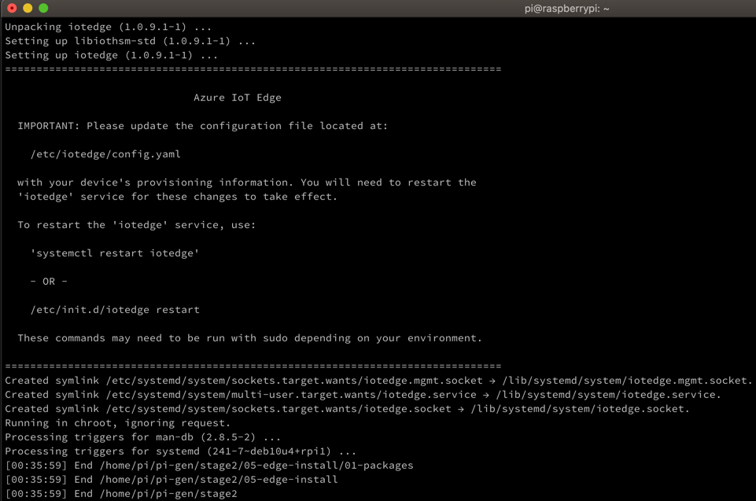
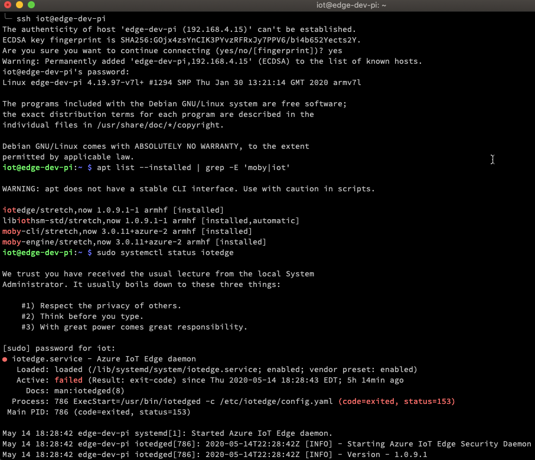

Recently I worked on [Automating Raspberry Pi Setup](https://wp.me/p8RapM-K9) but that relied on a setup script being copied to an SD card and run on the device. Near the end of that process I discovered [pi-gen](https://github.com/RPi-Distro/pi-gen), a tool used to create the [raspberrypi.org](https://www.raspberrypi.org/) Raspbian images. Later in working with [Azure IoT Edge](https://azure.microsoft.com/en-us/services/iot-edge/), I had a similar need to automate some Pi setup so I decided it was time to look into this further.

The goal was to create a Raspbian lite image with:

- Azure IoT Edge and its dependencies pre-installed
- Any custom software installs or configuration
- Different defaults for host name, username, password
- Different defaults for various locale settings - language, keyboard, timezone...

That image could then be used to provision multiple Raspberry Pi devices or to quickly reset an existing Pi device to a default good state.

## Prerequisites and Expectations

The pi-gen tool requires running on [Debian Buster](https://wiki.debian.org/DebianBuster) or [Ubuntu Xenial](https://releases.ubuntu.com/xenial/). I chose to run it on a spare Raspberry Pi 4 with 4 GB RAM but [Vagrant and VirtualBox](https://jonasrosland.com/simple-way-to-build-a-custom-docker-ready-raspberry-pi-image/) may be worth considering. The nature of the tool's build process also left me with the impression that running it on a "clean" machine is ideal - i.e. resetting the host to a default known state between builds.

It's also worth noting that building a custom image can take 20+ minutes or much longer depending on the host, build steps, and the stages being run. As such, it might be worth starting with a simple bash script against a default image and then transitioning to pi-gen when things are more solidified. Otherwise debugging can be a bit more difficult and the testing cycle longer.

There's also a bit of a learning curve with [how pi-gen's build process works](https://github.com/RPi-Distro/pi-gen#how-the-build-process-works). It's certainly [much easier than Yocto layers](https://www.yoctoproject.org/docs/what-i-wish-id-known/), but some studying of the internals may be required for the best results. I admit to not yet understanding the image build and [chroot](https://wiki.archlinux.org/index.php/Chroot) details as much as I'd like.

## Customization Approaches

If I had heavy customization needs I would probably fork the [pi-gen repo](https://github.com/RPi-Distro/pi-gen), remove what I didn't want, add additional steps, and make edits to existing steps.

In my case I only had a few modifications so I chose to go with a script to pull the repo, dynamically add some stage steps and configuration, then run its [build script](https://github.com/RPi-Distro/pi-gen/blob/master/build.sh).

## Install Script

First I created an install script to install the pi-gen dependencies, clone the repo, and make its build script executable.

\[bash\] #!/bin/bash

\# Bring system current sudo apt-get update && sudo apt-get -y upgrade

\# Install required pi-gen dependencies sudo apt-get -y install coreutils quilt parted qemu-user-static debootstrap zerofree zip \\ dosfstools bsdtar libcap2-bin grep rsync xz-utils file git curl bc

\# Get pi-gen git repo git clone https://github.com/RPi-Distro/pi-gen.git pushd pi-gen chmod +x build.sh popd \[/bash\]

## Build Script

Next I created a build script to wrap pi-gen's [build script](https://github.com/RPi-Distro/pi-gen/blob/master/build.sh), adding new steps to perform before invoking its build.

One of the configuration values for pi-gen is the default Pi user password so I started off with reading that from stdin and having a `clean` parameter for cases where the last build stage failed and needed to be re-run.

\[bash\] #!/bin/bash

SECONDS=0 clean=false

while \[\[ $# -ge 1 \]\]; do i="$1" case $i in -c|--clean) clean=true shift ;; \*) echo "Unrecognized option $1" exit 1 ;; esac shift done

read -r -t 2 -d $'\\0' pi\_pwd

if \[ -z "$pi\_pwd" \]; then echo "Pi user password is required (pass via stdin)" >&2 exit 1 fi \[/bash\]

When running the script I'd set an environment variable for the password and invoke with:

\[bash\] echo "$pass" | sudo -S /boot/build/build.sh \[/bash\]

Next the script creates a `config` file that the build process will source to set various configuration. Mostly I was interested in host name, username, password, and locale settings.

\[bash\] # Script is in /boot/setup, switch to non-root pi-gen path per install script. Assuming default pi user. pushd /home/pi/pi-gen

\# setup environment variables to tweak config. SD card write script will prompt for Wi-fi credentials. cat > config <<EOL export IMG\_NAME=edge-raspbian export RELEASE=buster export DEPLOY\_ZIP=1 export LOCALE\_DEFAULT=en\_US.UTF-8 export TARGET\_HOSTNAME=edge-dev-pi export KEYBOARD\_KEYMAP=us export KEYBOARD\_LAYOUT="English (US)" export TIMEZONE\_DEFAULT=America/New\_York export FIRST\_USER\_NAME=iot export FIRST\_USER\_PASS="${pi\_pwd}" export ENABLE\_SSH=1 EOL \[/bash\]

There are 5 major stages of the build, each with its own folder. Within each stage folder are subdirectories with various install scripts to run; these are ordered and run alpha-numerically, with a naming convention to control different aspects. Refer to the [build process](https://github.com/RPi-Distro/pi-gen#how-the-build-process-works) for more.

I only needed Raspbian lite and not the the desktop packages, docs, dev tools etc. so the script creates SKIP files to skip those stages. Stage 2 is Raspbian lite so that directory is then switched to in order to begin adding custom steps or "sub-stages" to stage 2.

\[bash\] # Skip stages 3-5, only want Raspbian lite touch ./stage3/SKIP ./stage4/SKIP ./stage5/SKIP touch ./stage4/SKIP\_IMAGES ./stage5/SKIP\_IMAGES

pushd stage2

\# don't need NOOBS rm -f EXPORT\_NOOBS || true \[/bash\]

My first custom step or "sub-stage" within stage 2 involves setting up prerequisites for IoT Edge. This includes preparing a package source and installing Moby Engine, Moby CLI, and Open SSL.

\[bash\] # ----- Begin Stage 02, Step 04 - IoT Edge Install Prereqs Step ----- step="04-edge-install-prereq" if \[ -d "$step" \]; then rm -Rf $step; fi mkdir $step && pushd $step

cat > 00-run-chroot.sh <<RUN #!/bin/bash echo "Installing repository configuration" curl https://packages.microsoft.com/config/debian/stretch/multiarch/prod.list > ./microsoft-prod.list cp -v ./microsoft-prod.list /etc/apt/sources.list.d/ rm -v -f ./microsoft-prod.list

echo "Installing the Microsoft GPG public key" curl https://packages.microsoft.com/keys/microsoft.asc | gpg --dearmor > microsoft.gpg cp -v ./microsoft.gpg /etc/apt/trusted.gpg.d/ rm -v -f microsoft.gpg

echo "Update package lists" apt-get update RUN

chmod +x 00-run-chroot.sh

cat > 01-packages <<RUN moby-engine moby-cli libssl1.0.2 RUN

popd # ----- End Stage 02, Step 04 - IoT Edge Install Prereqs Step ----- \[/bash\]

Stage 2 happens to currently have 3 numbered subdirectories which is why the step folder created begins with `04-`; granted there are more future-proof ways of handling that. First a script is created that will be run in the chroot of the image build directory to get package lists in order for Edge dependency packages to be installed. Next it creates a space-delimited file with the packages to install. Initially I had the `iotedge` package at the end of this list, assuming that each package would be fully installed sequentially before the next. I realized that wasn't the case from the `iotedge` package install errors.

The next stage 2 step folder created is to install `iotedge`, to be run after the packages it requires are installed.

\[bash\] # ----- Begin Stage 02, Step 05 - IoT Edge Install Step ----- step="05-edge-install" if \[ -d "$step" \]; then rm -Rf $step; fi mkdir $step && pushd $step

cat > 01-packages <<RUN iotedge RUN

popd # ----- End Stage 02, Step 05 - IoT Edge Install Step ----- \[/bash\]

The remainder of the script is invoking the build and checking the results.

\[bash\] popd # stage 02

\# run build if \[ "$clean" = true \] ; then echo "Running build with clean to rebuild last stage" CLEAN=1 ./build.sh else echo "Running build" ./build.sh fi

exitCode=$?

duration=$SECONDS echo "Build process completed in $(($duration / 60)) minutes"

if \[ $exitCode -ne 0 \]; then echo "Custom Raspbian lite build failed with exit code ${exitCode}" ; exit -1 fi

ls ./deploy \[/bash\]

## Running the Scripts

First I used a [sd-card-write.sh](https://geoffhudik.com/tech/2020/04/27/scripting-raspberry-pi-image-builds/) script to [download Raspbian Lite](https://downloads.raspberrypi.org/raspbian_lite_latest) and write it to an SD card. Then I created a `build` folder on the root of the SD card and copied the scripts over before ejecting and popping into the Pi.

After powering up the Pi I made the ssh connection and ran the script to install pi-gen.

\[shell\] ssh pi@raspberrypi.local

pi@raspberrypi:~ $ sudo /boot/build/install.sh \[/shell\]

Next I set a temporary environment variable for the initial password of the Pi image and passed that to the build script via stdin.

\[shell\] pi@raspberrypi:~ $ echo "$pass" | sudo -S /boot/build/build.sh \[/shell\]

After several minutes and significant output from stages 0-2, the custom added steps are executed.

After about 20 minutes when the build finishes I can see the compressed archive of the image in the `deploy` output folder.

...

\[23:28:13\] Begin /home/pi/pi-gen/export-image/04-finalise
\[23:28:13\] Begin /home/pi/pi-gen/export-image/04-finalise/01-run.sh
Stopping fake hwclock: saving system time.
Mode:     real
Files:    2708
Linked:   476 files
Compared: 0 xattrs
Compared: 889 files
Saved:    18.49 MiB
Duration: 0.20 seconds
  adding: 2020-05-14-edge-raspbian-lite.img (deflated 74%)
\[23:32:36\] End /home/pi/pi-gen/export-image/04-finalise/01-run.sh
\[23:32:36\] End /home/pi/pi-gen/export-image/04-finalise
\[23:32:36\] End /home/pi/pi-gen/export-image
\[23:32:37\] End /home/pi/pi-gen
Build process completed in 20 minutes
2020-05-14-edge-raspbian-lite.info  image\_2020-05-14-edge-raspbian-lite.zip

## Handling Build Issues

On build issues I'd dig through the output and make script adjustments. After that usually setting the `CLEAN` environment variable via running my build script with the `clean` argument was enough. The pi-gen build script would then rebuild the last stage and generally that was enough. In some cases I had the need to blow away the pi-gen repo and recreate it. That was problematic on failure as pi-gen locks a working directory so I had to restart the Pi first. In some extreme cases I'd reset the Pi I was building on to its default state to re-test everything with a clean slate.

## Verifying the Image

Once the build finished I copied the zip over to my machine from another terminal window.

\[bash\] scp 'pi@raspberrypi.local:~/pi-gen/deploy/\*zip' ~/temp \[/bash\]

For a work scenario I might then upload the image to an artifact repository like [Nexus](https://www.sonatype.com/product-nexus-repository) or [ProGet](https://inedo.com/proget) but for personal use my dev machine was sufficient.

At that point I renamed it as `image.zip` and moved it into a `downloads` folder used by my [SD card write script](https://geoffhudik.com/tech/2020/04/27/scripting-raspberry-pi-image-builds/). I ran that again, this time with the newly built custom image. After powering up the Pi with the new image on the SD card, it was time to verify the results.

\[bash\] ssh iot@edge-dev-pi

iot@edge-dev-pi:~ $ apt list --installed | grep -E 'moby|iot' iot@edge-dev-pi:~ $ sudo systemctl status iotedge iot@edge-dev-pi:~ $ docker -v \[/bash\]

Some device specific configuration is still needed for Azure IoT hub connectivity but having the software pre-installed and various OS details pre-configured saves valuable time.

## Source

The scripts are available in [pi-gen-iot-edge.zip](https://geoffhudik.com/wp-content/uploads/2020/05/pi-gen-iot-edge.zip) or in gist form as [pi-gen-install.sh](https://gist.github.com/thnk2wn/16f50f284aba539af67f5648f7ca9bfb) and [pi-gen-iot-edge-build.sh](https://gist.github.com/thnk2wn/2128e9b1fdfe726d8744ea05a304257e). There's also a similar but simpler example and related script in [rasp-cat-siren/pi-setup](https://github.com/thnk2wn/rasp-cat-siren/tree/master/pi-setup) as part of my [cat motion siren project](https://wp.me/p8RapM-Is).
