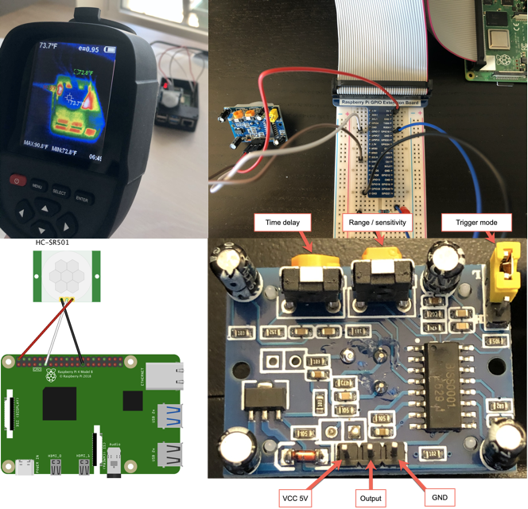
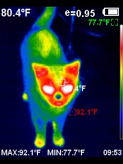
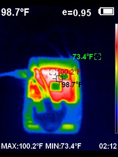
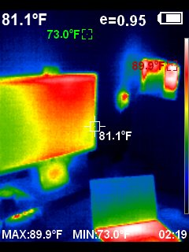
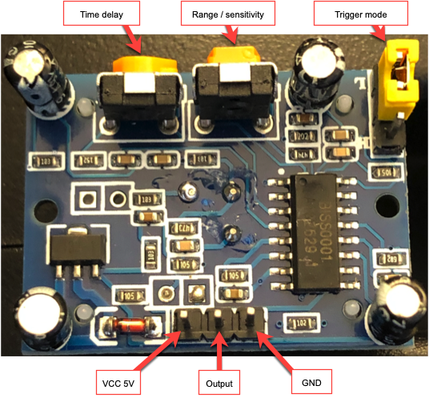
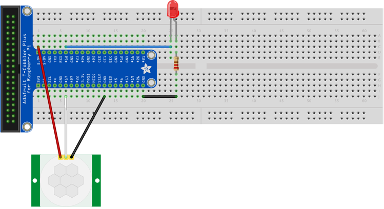
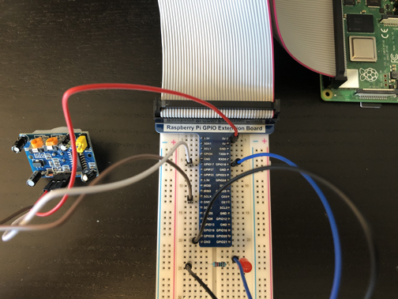
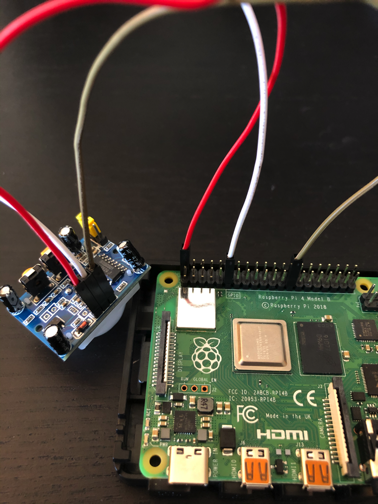
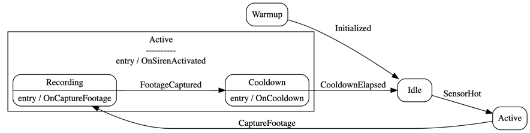
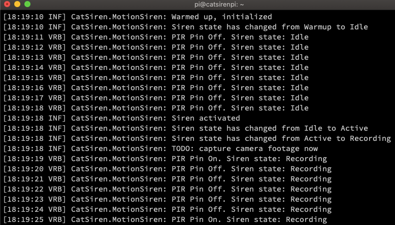

\[toc wrapping="left"\]

## Overview

The [last post](https://wp.me/p8RapM-MX) in this [Raspberry Pi Cat Motion Siren project](https://wp.me/p8RapM-Is) covered deploying .NET apps to Raspberry Pi through [GitHub Actions](https://github.com/features/actions) and Docker. With the deployment mechanism in place, it's time to dig deeper into the application code and Pi hardware.

This post covers connecting a passive infrared (PIR) motion sensor to the Raspberry Pi, configuring it, and reading it from a .NET application. Refer back to the [project overview](https://wp.me/p8RapM-Is) for the hardware used in this project.

### Passive Infrared Motion Sensors

PIR motion sensors such as the [HC-SR501](https://www.amazon.com/DIYmall-HC-SR501-Motion-Infrared-Arduino/dp/B012ZZ4LPM) used in this project work by detecting changes in infrared radiation levels, applying logic to determine motion, and setting sensor output to high when motion is detected. The motion aspect is a bit subjective and can be influenced by the sensor's hardware settings, the environment, and the application code reading the sensor.

Some specifics:

- Once powered on, the sensor will acclimate to the current infrared levels for later comparisons. This initialization period is ~1 minute.
- A Fresnel lens will focus IR signals onto two different pyroelectric sensors handling positive and negative output.
- When IR levels differ between the crystals in these sensors, PIR output is triggered.
- A differential amplifier helps the sensors cancel each other out when they both detect the same change at once, such as a brief flash of light or other interference. This helps reduce false positives that may not be motion.

### Infrared Imagery

To get a good feel for infrared and to have some fun, a thermal imager can be used. While there are some cheaper solutions like a [FLIR One](https://www.flir.com/products/flir-one-pro-lt/) module that attaches to a phone, a quality device isn't cheap. I bought and returned this [HTI HT-18 Thermal Imaging Camera](https://www.amazon.com/gp/product/B07BDJZ845/ref=ppx_yo_dt_b_asin_title_o02_s00?ie=UTF8&psc=1) - it's over $400 and is barely "prosumer" in quality. While I don't have enough of a need to keep it around, it can be a useful tool for home inspections - electrical, plumbing, insulation around windows, auto use etc.

    

## Hardware

### Electrical Disclaimer

Before getting into the hardware and wiring, this is my **disclaimer** that I'm not an electrical engineer, hardware guy, or an expert in electronics like the Pi. Always refer to hardware documentation and the experts.

Speaking of docs, one of my Pi accessories kit from China had some poor English in the docs and parts of it appeared to contradict itself or conflict with online sources. It never hurts to cross-reference multiple sources to prevent component damage, injury, and/or frustration.

### HC-SR501 PIR Motion Sensor

Below is a picture of my HC-SR501 PIR sensor with call-outs added. Note there are slightly different versions available.

  

Starting with the connections on the bottom, the leftmost is power / input voltage (5v-20v DC). The middle is output - motion detection results in a high output (3.3v), no motion results in low (0v). On the right is ground input.

At the top there are some adjustable settings, starting with 2 potentiometers on the left and a jumper on the far right.

- Time delay - controls how long the sensor will read high / on / "hot" after detecting motion. When that's turned counter-clockwise all the way to the left it's around 3 seconds and far right is 5 minutes.
- Sensitivity / range - from 7 meters at full left to 3 meters at full right. Detection area is within a 110 degree arc from the center of the sensor.
- Trigger mode selection - controls the start of the time delay after which the sensor will reset to low / off. As pictured it's in single trigger mode meaning that as soon as motion is detected the countdown to the time delay starts.
    
    Sliding the jumper cap off and onto the bottom is repeatable trigger mode, meaning that the countdown to the time delay will continue to reset as long as motion is detected.
    

These settings can influence the code reading the sensor so it's helpful giving them some thought upfront. I turned the time delay fully left to 3 seconds for a more real-time reading; I can always introduce delays in code. I left the range at its default mid-point setting but that's something I might adjust later based on the Pi location.

Trigger mode I initially left at single but would later change to repeatable. There's a 3 second period after the time delay expires where the sensor won't report anything (will always read low/off). Single trigger mode could result in too many "blind" periods. With repeat mode resetting the timer when there's still a variance in infrared levels, it can be more accurate and a smoother experience than frequent on/off switching with single mode.

### Quick Breadboard Test

I actually started without the breadboard as there's less wiring connecting the motion sensor directly to the Pi. However, the breadboard is useful for quick tests and experiments. Also in the spirit of tradition, there's an unwritten rule that you need to start with a blinking LED and that can be a handy indicator of the PIR sensor state.

Below is my first breadboard diagram attempt using [Fritzing](https://fritzing.org/home/); the `.fzz` files are in the [project docs](https://github.com/thnk2wn/rasp-cat-siren/tree/master/docs). It requires 3 male/female jumper cables for PIR sensor connections, 1 LED, a 220 Ω resistor (which I cut down) to restrict LED current draw, and 2 male/male cables - 1 for connecting the LED to the Pi and the other for grounding the resistor.

  

Some of the documentation I used had conflicting information on whether to use [3.3v](https://pinout.xyz/pinout/pin1_3v3_power) power or [5v power](https://pinout.xyz/pinout/pin2_5v_power). While it technically worked with the former, 5v was the safer choice.

It may be helpful to review basic details on [Pi wiring, breadboards, LEDs, and resistors](https://thepihut.com/blogs/raspberry-pi-tutorials/27968772-turning-on-an-led-with-your-raspberry-pis-gpio-pins). Depending on the power, LED(s), and other details, a resistor with a different ohm rating may be needed; finding similar examples or [doing the math](https://www.evilmadscientist.com/2012/resistors-for-leds/) never hurts.

  

The following code is a quick bare-bones test of this setup. Keep in mind this doesn't account for how long the sensor has been powered on; it will take a minute or more before the sensor will give accurate readings.

\[csharp\] using System; using System.Device.Gpio; using System.Threading;

namespace MotionSensorTest { class Program { private const int PIR\_PIN = 17; private const int LED\_PIN = 18;

static void Main(string\[\] args) { Console.WriteLine("Initializing GPIO");

using (var gpio = new GpioController()) using (var cts = new CancellationTokenSource()) { Console.CancelKeyPress += (s, e) => cts.Cancel();

gpio.OpenPin(PIR\_PIN, PinMode.Input); gpio.OpenPin(LED\_PIN, PinMode.Output);

Console.WriteLine("Monitoring PIR sensor. ctrl+c to cancel."); bool lastOn = false;

while (!cts.IsCancellationRequested) { bool pirOn = gpio.Read(PIR\_PIN) == true;

if (lastOn != pirOn) { Console.WriteLine($"Motion sensor is now {(pirOn ? "on" : "off")}"); lastOn = pirOn; gpio.Write(LED\_PIN, pirOn); } }

Console.WriteLine("Cleaning up"); gpio.ClosePin(PIR\_PIN); gpio.ClosePin(LED\_PIN); } } } } \[/csharp\]

After [Deploying to the Pi](https://wp.me/p8RapM-Kw), a quick test was in order. It's important to consider the warmup time and make sure you're well out of the viewing range of the sensor. Here I'm using a 3 second time delay and single trigger mode.

<iframe width="560" height="315" src="https://www.youtube.com/embed/fvEe9p8OEJc" frameborder="0" allow="accelerometer; autoplay; encrypted-media; gyroscope; picture-in-picture" allowfullscreen></iframe>

While the breadboard is setup, this is a good time to shutdown the Pi, try different PIR sensor hardware settings, power it back on, and test again to see the effect.

### Pi Motion Sensor Wiring

Non-breadboard use is straightforward with 3 female/female jumper cables.

- PIR sensor power to Pi [5v power](https://pinout.xyz/pinout/pin2_5v_power)
- PIR output to Pi [BCM 17 (physical pin 11)](https://pinout.xyz/pinout/pin11_gpio17)
- PIR ground to any Pi [ground pin](https://pinout.xyz/pinout/ground)

  

    

## The Application

### GPIO Libraries

Before .NET Core 3.x, I had used [Unosquare Raspberry IO](https://github.com/unosquare/raspberryio). With [.NET Core 3 IoT support](https://channel9.msdn.com/Shows/On-NET/IoT-support-for-NET-Core) and [System.Device.Gpio](https://www.nuget.org/packages/System.Device.Gpio) I moved away from Unosquare.

There's also an [IoT Device Bindings](https://www.nuget.org/packages/Iot.Device.Bindings) package, adding an abstraction over `System.Device.Gpio` for specific devices. For example there's a [HC-SR501 binding](https://github.com/dotnet/iot/blob/master/src/devices/Hcsr501/README.md) that makes using this very simple:

\[csharp\] using(Hcsr501 sensor = new Hcsr501(hcsr501Pin, PinNumberingScheme.Logical)) { // detect motion bool isDetected = sensor.IsMotionDetected; } \[/csharp\]

### GPIO Service

I ended up wrapping the GPIO code as follows.

\[csharp\] public class GpioService : DisposableObject, IGpioService { private GpioController gpio;

public void OpenPinInput(int pinNumber) { LazyInitialize(\_ => \_.OpenPin(pinNumber, PinMode.Input)); }

public bool Read(int pinNumber) { return this.gpio.Read(pinNumber) == true; }

public bool IsPinOpen(int pinNumber) { return this.gpio.IsPinOpen(pinNumber); }

public void ClosePin(int pinNumber) { if (IsPinOpen(pinNumber)) { this.gpio.ClosePin(pinNumber); } }

protected override void DisposeManagedResources() { this.gpio?.Dispose(); }

private void LazyInitialize(Action<GpioController> action) { if (this.gpio == null) { this.gpio = new GpioController(); }

action(this.gpio); } } \[/csharp\]

That was done mostly so I can still test much of the app workflow while developing and debugging on my dev machine. The switch happens at startup when configuring services, based on the current OS and DEBUG conditional.

\[csharp\] public void ConfigureServices(IServiceCollection services) { bool isTargetPlatform = true;

#if DEBUG isTargetPlatform = RuntimeInformation.IsOSPlatform(OSPlatform.Linux); #endif

if (isTargetPlatform) { services.AddSingleton<IGpioService, GpioService>(); } else { services.AddSingleton<IGpioService, SimulatedGpioService>(); } } \[/csharp\]

The simulated GPIO service just adds an element of randomness around whether the sensor is reading high/on.

\[csharp highlight="43"\] public class SimulatedGpioService : IGpioService { private Dictionary<int, bool> openPins = new Dictionary<int, bool>(); private readonly ILogger<SimulatedGpioService> logger;

public SimulatedGpioService(ILogger<SimulatedGpioService> logger) { this.logger = logger; }

public void Dispose() {}

public void OpenPinInput(int pinNumber) { if (!this.openPins.ContainsKey(pinNumber)) { this.openPins.Add(pinNumber, true); } else { this.openPins\[pinNumber\] = true; }

this.logger.LogInformation("Pin {pin} opened (simulated) in input mode", pinNumber); }

public bool IsPinOpen(int pinNumber) { return this.openPins.ContainsKey(pinNumber) && this.openPins\[pinNumber\] == true; }

public void ClosePin(int pinNumber) { if (this.openPins.ContainsKey(pinNumber)) { this.openPins\[pinNumber\] = false; this.logger.LogInformation("Pin {pin} closed (simulated)", pinNumber); } }

public bool Read(int pinNumber) { return RandomNumberGenerator.GetInt32(1, 100) <= 10; } } \[/csharp\]

### Motion Siren

A `MotionSiren` class serves as the key logic driver, continually reading the PIR sensor and coordinating actions based on sensor output, elapsed time, and other state.

\[csharp\] public class MotionSiren : DisposableObject, IMotionSiren { private readonly SirenSettings settings; private readonly ILogger<MotionSiren> logger; private readonly IGpioService gpio;

private readonly StateMachine<SirenState, SirenTrigger> machine;

public MotionSiren( SirenSettings settings, ILogger<MotionSiren> logger, IGpioService gpio) { this.settings = settings; this.logger = logger; this.gpio = gpio; this.machine = CreateStateMachine(); } } \[/csharp\]

At construction it creates a state machine to define the siren states and transitions between them. The state machine is arguably overkill but it is handy knowing one current state at any given moment and defining rules to ensure the app doesn't get in an invalid state. Plus this is a fun learning project, so why not?

I used [stateless](https://github.com/dotnet-state-machine/stateless) as the library; I also evaluated [appcellerate/statemachine](https://github.com/appccelerate/statemachine) but found it to be more code. Enums are created for the states and triggers. As each state is configured, the allowed triggers are set and each is mapped to the corresponding destination state.

\[csharp\] private StateMachine<SirenState, SirenTrigger> CreateStateMachine() { var machine = new StateMachine<SirenState, SirenTrigger>( () => this.State, newState => this.State = newState);

machine.OnTransitioned(t => this.logger.LogInformation("Siren state has changed from {source} to {dest}", t.Source, t.Destination));

machine.Configure(SirenState.Warmup) .Permit(SirenTrigger.Initialized, SirenState.Idle);

machine.Configure(SirenState.Idle) .Permit(SirenTrigger.SensorHot, SirenState.Active);

machine.Configure(SirenState.Active) .Permit(SirenTrigger.CaptureFootage, SirenState.Recording) .OnEntryAsync(OnSirenActivated);

machine.Configure(SirenState.Recording) .SubstateOf(SirenState.Active) .Permit(SirenTrigger.FootageCaptured, SirenState.Cooldown) .OnEntryAsync(OnCaptureFootage);

machine.Configure(SirenState.Cooldown) .SubstateOf(SirenState.Active) .Permit(SirenTrigger.CooldownElapsed, SirenState.Idle) .OnEntryAsync(OnCooldown);

return machine; } \[/csharp\]

To help visualize the state machine I'd run the below while debugging.

\[csharp\] System.Diagnostics.Debug.WriteLine(Stateless.Graph.UmlDotGraph.Format(machine.GetInfo())); \[/csharp\]

Which outputs this [dot graph](https://en.wikipedia.org/wiki/DOT_(graph_description_language)) syntax.

digraph {
compound=true;
node \[shape=Mrecord\]
rankdir="LR"

subgraph clusterActive
	{
	label = "Active\\n----------\\nentry / OnSirenActivated"
Recording \[label="Recording|entry / OnCaptureFootage"\];
Cooldown \[label="Cooldown|entry / OnCooldown"\];
}
Warmup \[label="Warmup"\];
Idle \[label="Idle"\];

Warmup -> Idle \[style="solid", label="Initialized"\];
Idle -> Active \[style="solid", label="SensorHot"\];
Active -> Recording \[style="solid", label="CaptureFootage"\];
Recording -> Cooldown \[style="solid", label="FootageCaptured"\];
Cooldown -> Idle \[style="solid", label="CooldownElapsed"\];
}

Various tools exist to work with these; I mostly used [Edotor](https://edotor.net/). Pasting in the output there and changing the `Engine` to `DOT` produced the following diagram.

  

The `MotionSiren` entry point performs some initialization and then continues to read and react to the sensor state as long as cancellation isn't requested / app is not shutting down.

\[csharp\] public async Task MonitorAsync(CancellationToken stoppingToken) { await InitializeAsync(stoppingToken);

while (!stoppingToken.IsCancellationRequested) { await SetSensorState(this.gpio.Read(this.settings.PirPin)); await Task.Delay(1000); this.LogVerboseState(); } } \[/csharp\]

The initialization is mostly just delaying a minute to give the PIR sensor the time it needs to acclimate to the initial infrared levels to establish the baseline for future changes. The assumption here is that the app is starting up when the host boots.

In my case I'm opening the PIR pin and then delaying but I believe the warmup period starts once the sensor is powered on. Using the OS system uptime could potentially avoid the need for a delay in cases.

\[csharp\] private async Task InitializeAsync(CancellationToken cancelToken) { TimeSpan warmupDelay = TimeSpan.FromSeconds(this.settings.WarmupInterval);

this.logger.LogInformation("Opening PIR pin {pin}", this.settings.PirPin); this.gpio.OpenPinInput(this.settings.PirPin);

this.logger.LogInformation( "Waiting for warmup for {seconds} seconds until {readyTime:G}", this.settings.WarmupInterval, DateTime.Now.Add(warmupDelay)); await Task.Delay(warmupDelay, cancelToken);

this.logger.LogInformation("Warmed up, initialized"); await this.machine.FireAsync(SirenTrigger.Initialized); } \[/csharp\]

The `SetSensorState` method called in the while loop of `MonitorAsync` invokes the appropriate trigger according to PIR sensor state.

\[csharp\] private async Task SetSensorState(bool isOn) { this.SensorState = isOn; SirenTrigger trigger = isOn ? SirenTrigger.SensorHot : SirenTrigger.SensorCold;

if (this.machine.CanFire(trigger)) { await this.machine.FireAsync(trigger); } } \[/csharp\]

It is important not to mix calls to the Stateless state machine `FireAsync` and `Fire` - either they should all be async or none be. The appcellerate state machine makes this easier by forcing creation of either an async state machine or a non-async one upfront.

Another difference between the two is Stateless throws an exception when firing a trigger leads to a state that's not currently valid whereas appcellerate silently ignores it but allow you to react to it being rejected. The Stateless `CanFire` method is used when firing a trigger might not be valid based on current state.

When the PIR sensor reads high the `SensorHot` trigger fires, transitioning into the `Active` state. The state machine setup configured `OnSirenActivated` to be called when entering this state so it will fire next.

\[csharp\] private async Task OnSirenActivated() { this.logger.LogInformation("Siren activated"); await Task.Delay(500); await this.machine.FireAsync(SirenTrigger.CaptureFootage); } \[/csharp\]

The `CaptureFootage` trigger leads to the `Recording` state and entry into that state fires `OnCaptureFootage`. I'm using the thread pool here for 2 reasons. First, the intent is to use a camera to record several seconds of photos and video and that's resource intensive. Second, I want to still get console logging progress output while this is executing.

\[csharp\] private Task OnCaptureFootage() { ThreadPool.QueueUserWorkItem(CaptureFootage); return Task.CompletedTask; }

private async void CaptureFootage(object state) { // TODO: implement camera service and record photos / video here up to X configured period await Task.Delay(TimeSpan.FromSeconds(10));

await this.machine.FireAsync(SirenTrigger.FootageCaptured); } \[/csharp\]

The next post in this series will cover using the camera when motion is detected - for now it's just a delay. Once the `FootageCaptured` trigger fires, a `Cooldown` state begins. This ensures that regardless of the sensor hardware settings that the app isn't constantly reacting to it reading high and recording camera footage too much.

\[csharp\] private Task OnCooldown() { Observable.Timer(TimeSpan.FromSeconds(settings.ResetMotionAfter)) .Select(l => Observable.FromAsync(CompleteCooldown)) .Concat() .Subscribe();

return Task.CompletedTask; }

private async Task CompleteCooldown() { await this.machine.FireAsync(SirenTrigger.CooldownElapsed); } \[/csharp\]

Here I'm using [Reactive Extensions for .NET](https://github.com/dotnet/reactive) to trigger the next state after a given duration but a basic timer works. Once the time elapses, a `CooldownElapsed` trigger will reset the cycle by setting state to `Idle`.

### Motion Host

This app is an ASP.NET Core web API, partially so I can make calls to it externally - maybe to get captured footage for example. The `MotionSiren` lives inside a `MotionHost` [BackgroundService](https://docs.microsoft.com/en-us/aspnet/core/fundamentals/host/hosted-services?view=aspnetcore-3.1&tabs=visual-studio).

\[csharp highlight="19"\] public class MotionHost : BackgroundService { private readonly ILogger<MotionHost> logger; private readonly IMotionSiren motionSiren;

public MotionHost( ILogger<MotionHost> logger, IMotionSiren motionSiren) { this.motionSiren = motionSiren; this.logger = logger; }

protected override async Task ExecuteAsync(CancellationToken stoppingToken) { this.logger.LogInformation("Motion sensor host is starting up"); stoppingToken.Register(Shutdown);

await this.motionSiren.MonitorAsync(stoppingToken); }

private void Shutdown() { this.logger.LogInformation("Motion sensor hosted service is shutting down"); this.motionSiren?.Dispose(); } } \[/csharp\]

### Trying it Out

Testing is easier combined with a Pi camera but some isolated motion sensor testing is helpful. Yes that's a rubber band holding the sensor up - that's naturally not recommended and is on my TODO list.

<iframe width="900" height="508" src="https://www.youtube.com/embed/jBygGQ38O-U" frameborder="0" allow="accelerometer; autoplay; encrypted-media; gyroscope; picture-in-picture" allowfullscreen></iframe>

Cranking the log level to `Verbose` shows the last PIR pin reading combined with the current state.

## Going Further

The code for this post is available in this [rasp-cat-siren](https://github.com/thnk2wn/rasp-cat-siren/tree/master/siren) repo.

I found these resources helpful for this project:

- [Introduction to HC-SR501](https://www.theengineeringprojects.com/2019/01/introduction-to-hc-sr501.html) (Engineering Projects)
- [Using the HC-SR501 PIR Motion Sensor](https://dronebotworkshop.com/using-pir-sensors-with-arduino-raspberry-pi/) (DroneBot Workshop)
- [Arduino HC-SR501 Motion Sensor Tutorial](http://henrysbench.capnfatz.com/henrys-bench/arduino-sensors-and-input/arduino-hc-sr501-motion-sensor-tutorial/) (Henry's Bench)
- [PIR Sensor Datasheet](https://www.homemade-circuits.com/pir-sensor-datasheet-pinout-specification-working/) (Homemade Circuit Projects)

### Ultrasonic Range Sensor

Use of an [Ultrasonic Range Sensor](https://thepihut.com/blogs/raspberry-pi-tutorials/hc-sr04-ultrasonic-range-sensor-on-the-raspberry-pi) can be a good compliment to the PIR sensor. This would allow distance approximation which could be used to fine-tune motion response based on target proximity.

### Up Next

The next post in this series will start capturing photos and video once motion is detected. It will cover use of a couple different cameras and camera libraries.
